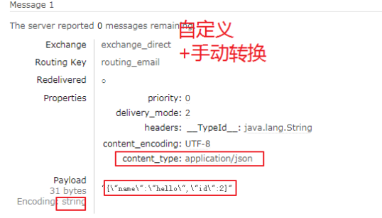
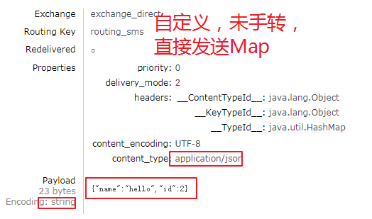
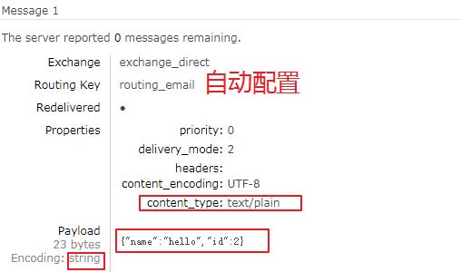

# RabbitMQ

##基础：

###==相关概念：==

>`Broker（Server）`：接受客户端连接，实现AMQP消息队列和路由功能的进程。
>
>`Virtual Host`：虚拟主机，表示一批交换器、消息队列和相关对象。虚拟主机是共享相同的身份认证和加密环境的独立服务器域。**每个 vhost 本质上就是一个 mini 版的 RabbitMQ 服务器**，拥有自己的队列、交换器、绑定和权限机制。vhost 是 AMQP 概念的基础，必须在连接时指定，RabbitMQ 默认的 vhost 是 / 。
>
>`Exchange`：接受生产者发送的消息，并根据Binding规则将消息路由给服务器中的队列。ExchangeType决定了Exchange路由消息的行为，例如，在RabbitMQ中，ExchangeType有direct、Fanout和Topic三种，不同类型的Exchange路由的行为是不一样的。
>
>`Message Queue`：消息队列，用于存储还未被消费者消费的消息。
>
>`Message`：由Header和Body组成，Header是由生产者添加的各种属性的集合，包括routing-key（路由键）、priority（相对于其他消息的优先权）、delivery-mode（指出该消息可能需要持久性存储） 。而Body是真正需要传输的APP数据，body是不透明的。
>
>`Binding`：Binding联系了Exchange与Message Queue。Exchange在与多个Message Queue发生Binding后会生成一张路由表，路由表中存储着Message Queue所需消息的限制条件即  Binding Key。当Exchange收到Message时会解析其Header得到Routing Key，Exchange根据Routing Key与ExchangeType将Message路由到MessageQueue。`Binding Key`**由Consumer在Binding Exchange与MessageQueue时指定**，而`Routing Key`**由Producer发送Message时指定，两者的匹配方式由ExchangeType决定**。
>
>`Connection`：连接，对于RabbitMQ而言，其实就是一个位于客户端和Broker之间的TCP连接。
>
>`Channel`：信道，仅仅创建了客户端到Broker之间的连接后，客户端还是不能发送消息的。需要为每一个Connection创建Channel，AMQP协议规定只有通过Channel才能执行AMQP的命令。一个Connection可以包含多个Channel。
>
>之所以需要Channel，是因为TCP连接的建立和释放都是十分昂贵的，如果一个客户端每一个线程都需要与Broker交互，如果每一个线程都建立一个TCP连接，暂且不考虑TCP连接是否浪费，就算操作系统也无法承受每秒建立如此多的TCP连接。RabbitMQ建议客户端线程之间不要共用Channel，至少要保证共用Channel的线程发送消息必须是串行的，但是建议尽量共用Connection。
>
>`Command`：AMQP的命令，客户端通过Command完成与AMQP服务器的交互来实现自身的逻辑。例如在RabbitMQ中，客户端可以通过publish命令发送消息，txSelect开启一个事务，txCommit提交一个事务。
>
>消息中间件的主要功能是消息的路由(Routing)和缓存(Buffering)。在AMQP中提供类似功能的两种域模型：Exchange 和 Messagequeue。


Exchange接收消息生产者(MessageProducer)发送的消息根据不同的路由算法将消息发送往Message queue。Messagequeue会在消息不能被正常消费时缓存这些消息，具体的缓存策略由实现者决定，当message queue与消息消费者(Messageconsumer)之间的连接通畅时，Message queue有将消息转发到consumer的责任。 

###==Exchange交换类型：==

常见四种类型：direct（默认）、fanout、topic、headers 。

```
1.direct：严格按照RoutingKey 与 BindingKey进行匹配，只会将消息发送给匹配到的队列。---route

2.fanout：忽略双key，直接将消息发送给交换器绑定的所有队列。--->pub/sub

3.Top：Top也是根据双Key匹配，但和direct有所区别：
	将双key的格式约定为英文句号 '.'分割的多个单词。并且每个单词中可以使用通配符：
		* 【一个单词】
		# 【0个或多个单词】
4.headers：根据消息的header中的属性进行匹配
```

`对比：`

* direct是完全匹配、单播的模式；而Topic是模式匹配，多播模式
* 当特殊字符“ * ”（星号）和“ ＃ ”（哈希）未在绑定中使用时，Top交换的行为就像direct交换一样。  
* fanout 类型转发消息是最快的。
* headers 交换器和 direct 交换器完全一致，但性能差很多，使用很少 

###队列：

消息队列，真正用来存放消息，FIFO（先进先出）

**多次声明同一个队列时，若属性相同，不会报错，如果前后队列的属性不一致，会报错**

分类：

​	临时队列：queue中的数据在MQ重启后，会丢失

​	持久化队列：queue中的消息，会在Server本地存储一份

​	自动删除队列：不存在用户连接Server时，队列中的数据自动删除

​	私有化队列：该队列，仅对当前连接可见

​	死信队列：

​	优先级队列：

####==死信队列：==

>DLX(Dead-Letter-Exchange)死信交换器，当消息在一个队列中变成死信之后，它能被重新被发送到另一个交换器中，这个交换器就是DLX ，绑定DLX的队列就称之为死信队列。 
>
>消息变成死信主要有以下几种情况:
>
>- 消息被拒绝(BasicReject/BasicNack) ，井且设置requeue 参数为false;(消费者确认机制将会在下一篇文章中涉及)
>- 消息过期;
>- 队列达到最大长度。
>
>​    DLX也是一个正常的交换器，和一般的交换器没有区别，它能在任何的队列上被指定，实际上就是设置某个队列的属性。当这个队列中存在死信时，RabbitMQ 就会自动地将这个消息重新发布到设置的DLX上去，进而被路由到另一个队列，即死信队列。可以监听这个队列中的消息、以进行相应的处理

**设置==普通队列==的属性：**

`x-dead-letter-exchange ` : 指定死信队列的交换器

`x-dead-letter-routing-key ` : 指定死信队列的路由 

```java
    @Test
    public void testDeadQueue() throws IOException {
        channel.exchangeDeclare("普通交换器", BuiltinExchangeType.DIRECT, true);
        channel.exchangeDeclare("死信交换器", BuiltinExchangeType.DIRECT, true);

        Map<String,Object> args = new HashMap<>();
        args.put("x-message-ttl",10000);// 10秒过期
        args.put("x-dead-letter-exchange","死信交换器");// 指定死信交换器的名称
        args.put("x-dead-letter-routing-key","dk");// 死信交换器的路由

        channel.queueDeclare("普通队列", true, false,false, args);
        channel.queueDeclare("死信队列", true, false,false, null);

        channel.queueBind("普通队列", "普通交换器", "pk");
        channel.queueBind("死信队列", "死信交换器", "dk");
        // 消息首先会发生到普通队列，10秒后，消息过期，成为死信，自动移动到死信队列
        channel.basicPublish("普通交换器", "pk", null, "普通交换器和普通队列:10秒后队列过期".getBytes(StandardCharsets.UTF_8));
    }
```


####==优先级队列：==

>1. 将==队列==声明为优先级队列，即在创建队列的时候添加参数 **x-max-priority** 以指定最大的优先级，值为0-255（整数）。
>2. 为==消息==添加优先级。

>**没有指定优先级的消息会将优先级以0对待。 **
>
>**对于超过优先级队列所定最大优先级的消息，优先级以最大优先级对待。**
>
>**对于相同优先级的消息，后进的排在前面。**
>
>**如果在消费者的消费速度大于生产者的速度且Broker 中没有消息堆积的情况下， 对发送的消息设置优先级也就没有什么实际意义。因为生产者刚发送完一条消息就被消费者消费了，那么就相当于Broker 中至多只有一条消息，对于单条消息来说优先级是没有什么意义的。** 


为了确保消息永不丢失，RabbitMQ支持 [消息*确认*](https://www.rabbitmq.com/confirms.html)。消费者发回ack（nowledgement）告诉RabbitMQ已收到，处理了特定消息，RabbitMQ可以自由删除它。

如果消费者死亡（其通道关闭，连接关闭或TCP连接丢失）而不发送确认，RabbitMQ将理解消息未完全处理并将重新排队。如果同时有其他在线消费者，则会迅速将其重新发送给其他消费者。这样你就可以确保没有消息丢失，即使工人偶尔会死亡。

没有任何消息超时; 当消费者死亡时，RabbitMQ将重新发送消息。即使处理消息需要非常长的时间，也没关系。

`Tips:`

​	**如果交换器没有绑定队列 或 在双key匹配类型中，匹配失败，那么发送给该交换器的消息会  `丢失`**

```
* fanout：对应的rabbitmq的工作模式是 publish/subscribe
* direct：对应的Routing    工作模式
* topic：对应的Topics工作模式
* headers： 对应的headers工作模式
```

简单队列：

​	没有交换机

发布订阅：

​	就是fanout

route:

​	direct

Topic:

​	topic

###消息：

####**mandatory参数：**

​	当交换器无法根据自身的类型和路由键找到一个符合条件的队列 时：

​		true:return回调，

​		false:消息直接丢弃

####**备份交换器：**

​	**创建==普通交换器==时，设置其参数：指定备份的交换器： `alternate-exchange `**

**部分代码：**

```java
//设置参数
Map<String.Object> argsMap = new HashMap<>();
// 关键:设置属性：key固定，value是备用交换器的名字
argsMap.put("alternate-exchange",EXCHANGE_ALTERNATE);
// 在声明普通交换器时，设置其属性：
channel.exchangeDeclare(EXCHANGE_ONE, BuiltinExchangeType.DIRECT, false,false,argsMap);
// 声明共用备用交换器
channel.exchangeDeclare(EXCHANGE_ALTERNATE, BuiltinExchangeType.FANOUT,true);
...
// 当发送一个不可以被路由的消息时，消息最终会进入备份队列
```

>- 如果设置的备份交换器不存在，客户端和RabbitMQ 服务端都不会有异常出现，此时消息会丢失。
>- 如果备份交换器没有绑定任何队列，客户端和RabbitMQ 服务端都不会有异常出现，此时消息会丢失。
>- 如果备份交换器没有任何匹配的队列，客户端和RabbitMQ 服务端都不会有异常出现，此时消息会丢失。
>- 如果备份交换器和mandatory参数一起使用，那么mandatory参数无效。

####TTL(消息过期时间)

>目前有两种方法可以设置消息的TTL。
>
>第一种方法是通过队列属性设置，队列中所有消息都有**相同的过期时间。**
>
>第二种方法是对消息本身进行**单独设置**，每条消息的TTL可以不同。
>
>**如果两种方法同时使用**，则消息的TTL 以两者之间**较小的那个数值为准**。
>
>消息在队列中的生存时间一旦超过设置的TTL值时，就会变成**"死信" (Dead Message)** ，消费者将无法再收到该消息 

**队列设置：**

​	**在==声明队列时==，设置队列的参数： `x-message-ttl `,以  `毫秒`为单位**

```
1.如果不设置TTL.则表示此消息不会过期;
2.将TTL设置为0 ，则表示除非此时可以直接将消息投递到消费者，否则该消息会被立即丢弃(或由死信队列		来处理) 
```

```java
Map<String.Object> argsMap = new HashMap<>();
argsMap.put("x-message-ttl", 3000);
channel.QueueDeclare("ttlQueue", true, false, false, args);
```

**单独设置：**

​	**在==发布消息时==，设置properties参数：  `Expiration `,同样以毫秒为单位**

```
 BasicProperties properties = new BasicProperties()
            {
                Expiration = "20000",//设置TTL为20000毫秒
            };
 var message = Encoding.UTF8.GetBytes("TestMsg");
 channel.BasicPublish("normalExchange", "NormalRoutingKey", true, properties, message);
```


>**对于第一种设置队列TTL属性的方法，一旦消息过期，就会从队列中抹去，而在第二种方法中，即使消息过期，也不会马上从队列中抹去，因为每条消息是否过期是在即将投递到消费者之前判定的。Why?在第一种方法里，队列中己过期的消息肯定在队列头部， RabbitMQ 只要定期从队头开始扫描是否有过期的消息即可。而第二种方法里，每条消息的过期时间不同，如果要删除所有过期消息势必要扫描整个队列，所以不如等到此消息即将被消费时再判定是否过期，如果过期再进行删除即可。** 


###常用API：

**声明队列：**

```java
/**
* 1、queue 队列名称
* 2、durable 是否持久化，如果持久化，mq重启后队列还在
* 3、exclusive 是否独占连接，队列只允许在该连接中访问，如果connection连接关闭队列则自动删除,如果将此参数设置true可用于临时队列的创建
 * 4、autoDelete 自动删除，队列不再使用时是否自动删除此队列，如果将此参数和exclusive参数设置为true就可以实现临时队列（队列不用了就自动删除）
* 5、arguments 参数，可以设置一个队列的扩展参数，比如：可设置存活时间
 */
 channel.queueDeclare(QUEUE_INFORM_EMAIL,true,false,false,null);
```

**声明交换机：**

```java
/**
* 参数明细：
* 1、交换机的名称
* 2、交换机的类型
* fanout：对应的rabbitmq的工作模式是 publish/subscribe
* direct：对应的Routing	工作模式
* topic：对应的Topics工作模式
* headers： 对应的headers工作模式
*/
channel.exchangeDeclare(EXCHANGE_TOPICS_INFORM, BuiltinExchangeType.TOPIC);
```

**队列绑定交换机：**

```java
 /**
* 参数明细：
* 1、queue 队列名称
* 2、exchange 交换机名称
* 3、routingKey 路由key，作用是交换机根据路由key的值将消息转发到指定的队列中，在发布订阅模式中调协为空字符串
*/
channel.queueBind(QUEUE_INFORM_EMAIL,EXCHANGE_TOPICS_INFORM,ROUTINGKEY_EMAIL);
```

**发送消息：**

```
//发送消息
            //参数：String exchange, String routingKey, BasicProperties props, byte[] body
            /**
             * 参数明细：
             * 1、exchange，交换机，如果不指定将使用mq的默认交换机（设置为""）
             * 2、routingKey，路由key，交换机根据路由key来将消息转发到指定的队列，
             如果使用默认交换机，routingKey设置为队列的名称
             * 3、props，消息的属性
             * 4、body，消息内容
             */
              channel.basicPublish(EXCHANGE_TOPICS_INFORM,"inform.sms.email",null,message.getBytes());
```

**消费消息和监听消息:**

```java
 //实现消费方法
        DefaultConsumer defaultConsumer = new DefaultConsumer(channel){

            /**
             * 当接收到消息后此方法将被调用
             * @param consumerTag  消费者标签，用来标识消费者的，在监听队列时设置channel.basicConsume
             * @param envelope 信封，通过envelope
             * @param properties 消息属性
             * @param body 消息内容
             * @throws IOException
             */
            @Override
            public void handleDelivery(String consumerTag, Envelope envelope, AMQP.BasicProperties properties, byte[] body) throws IOException {
                //交换机
                String exchange = envelope.getExchange();
                //消息id，mq在channel中用来标识消息的id，可用于确认消息已接收
                long deliveryTag = envelope.getDeliveryTag();
                //消息内容
                String message= new String(body,"utf-8");
                System.out.println("receive message:"+message);
            }
        };

        //监听队列
        //参数：String queue, boolean autoAck, Consumer callback
        /**
         * 参数明细：
         * 1、queue 队列名称
         * 2、autoAck 自动回复，当消费者接收到消息后要告诉mq消息已接收，如果将此参数设置为tru表示会自动回复mq，如果设置为false要通过编程实现回复
         * 3、callback，消费方法，当消费者接收到消息要执行的方法
         */
        channel.basicConsume(QUEUE_INFORM_EMAIL,true,defaultConsumer);
```


###管理插件：

**1.用户角色：**

>1、超级管理员(administrator)
>	可登陆管理控制台，可查看所有的信息，并且可以对用户，策略(policy)进行操作。
>2、监控者(monitoring)
>	可登陆管理控制台，同时可以查看rabbitmq节点的相关信息(进程数，内存使用情况，磁盘使用情况等)
>3、策略制定者(policymaker)
>	可登陆管理控制台, 同时可以对policy进行管理。但无法查看节点的相关信息(上图红框标识的部分)。
>4、普通管理者(management)
>	仅可登陆管理控制台，无法看到节点信息，也无法对策略进行管理。
>5、其他:无权限，普通的生产者和消费者


没有的虚拟主机会报错
无法登陆管理控制台，通常就是普通的生产者和消费者。

### 应用场景：

以常见的订单系统为例，用户点击【下单】按钮之后的业务逻辑可能包括：扣减库存、生成相应单据、发红包、发短信通知。在业务发展初期这些逻辑可能放在一起同步执行，随着业务的发展订单量增长，需要提升系统服务的性能，这时可以将一些不需要立即生效的操作拆分出来异步执行，比如发放红包、发短信通知等。这种场景下就可以用 MQ ，在下单的主流程（比如扣减库存、生成相应单据）完成之后发送一条消息到 MQ 让主流程快速完结，而由另外的单独线程拉取MQ的消息（或者由 MQ 推送消息），当发现 MQ 中有发红包或发短信之类的消息时，执行相应的业务逻辑。

**以上是用于业务解耦的情况，其它常见场景包括最终一致性、广播、错峰流控等等。**

## 安装与配置：

RabbitMQ的安装使用需要erlang开发环境，所以需要先去下载erlang，才能完成RabbitMQ的安装：

`Tips:`

​	RabbitMQ支持的erlang有版本要求，具体可参看RabbitMQ的官网

###windows环境：


windows如果无法启动管理插件：

1.开启

```
rabbitmqctl start_app
rabbitmq-plugins enable rabbitmq_management
```


不行的话，服务-属性-设置账户


###linux环境：


## Demo:

### 原生：

**环境搭建：**

* 导入maven依赖：

```xml
<dependency>
    <groupId>com.rabbitmq</groupId>
    <artifactId>amqp-client</artifactId>
    <version>4.1.0</version>
</dependency>
```

**编码：**

```java
package com.wxss.rabbitmqboot;

import com.rabbitmq.client.BuiltinExchangeType;
import com.rabbitmq.client.Channel;
import com.rabbitmq.client.Connection;
import com.rabbitmq.client.ConnectionFactory;

import java.io.IOException;
import java.util.concurrent.TimeoutException;

/**
 * @author Administrator
 * @version 1.0
 * @create 2018-06-17 18:10
 **/
public class Producer02_publish {
    //队列名称
    private static final String QUEUE_INFORM_EMAIL = "queue_inform_email";
    private static final String QUEUE_INFORM_SMS = "queue_inform_sms";
    private static final String EXCHANGE_FANOUT_INFORM = "exchange_fanout_inform";

    public static void main(String[] args) {
        //通过连接工厂创建新的连接和mq建立连接
        ConnectionFactory connectionFactory = new ConnectionFactory();
        connectionFactory.setHost("127.0.0.1");
        connectionFactory.setPort(5672);//端口
        connectionFactory.setUsername("guest");
        connectionFactory.setPassword("guest");
        //设置虚拟机，一个mq服务可以设置多个虚拟机，每个虚拟机就相当于一个独立的mq
        connectionFactory.setVirtualHost("/");

        Connection connection = null;
        Channel channel = null;
        try {
            //建立新连接
            connection = connectionFactory.newConnection();
            //创建会话通道,生产者和mq服务所有通信都在channel通道中完成
            channel = connection.createChannel();
            //声明队列，如果队列在mq 中没有则要创建
            //参数：String queue, boolean durable, boolean exclusive, boolean autoDelete, Map<String, Object> arguments
            /**
             * 参数明细
             * 1、queue 队列名称
             * 2、durable 是否持久化，如果持久化，mq重启后队列还在
             * 3、exclusive 是否独占连接，队列只允许在该连接中访问，如果connection连接关闭队列则自动删除,如果将此参数设置true可用于临时队列的创建
             * 4、autoDelete 自动删除，队列不再使用时是否自动删除此队列，如果将此参数和exclusive参数设置为true就可以实现临时队列（队列不用了就自动删除）
             * 5、arguments 参数，可以设置一个队列的扩展参数，比如：可设置存活时间
             */
            channel.queueDeclare(QUEUE_INFORM_EMAIL, true, false, false, null);
            channel.queueDeclare(QUEUE_INFORM_SMS, true, false, false, null);
            //声明一个交换机
            //参数：String exchange, String type
            /**
             * 参数明细：
             * 1、交换机的名称
             * 2、交换机的类型
             * fanout：对应的rabbitmq的工作模式是 publish/subscribe
             * direct：对应的Routing	工作模式
             * topic：对应的Topics工作模式
             * headers： 对应的headers工作模式
             */
            channel.exchangeDeclare(EXCHANGE_FANOUT_INFORM, BuiltinExchangeType.FANOUT);
            //进行交换机和队列绑定
            //参数：String queue, String exchange, String routingKey
            /**
             * 参数明细：
             * 1、queue 队列名称
             * 2、exchange 交换机名称
             * 3、routingKey 路由key，作用是交换机根据路由key的值将消息转发到指定的队列中，在发布订阅模式中调协为空字符串
             */
            channel.queueBind(QUEUE_INFORM_EMAIL, EXCHANGE_FANOUT_INFORM, "");
            channel.queueBind(QUEUE_INFORM_SMS, EXCHANGE_FANOUT_INFORM, "");
            //发送消息
            //参数：String exchange, String routingKey, BasicProperties props, byte[] body
            /**
             * 参数明细：
             * 1、exchange，交换机，如果不指定将使用mq的默认交换机（设置为""）
             * 2、routingKey，路由key，交换机根据路由key来将消息转发到指定的队列，如果使用默认交换机，routingKey设置为队列的名称
             * 3、props，消息的属性
             * 4、body，消息内容
             */
            for (int i = 0; i < 5; i++) {
                //消息内容
                String message = "send inform message to user";
                channel.basicPublish(EXCHANGE_FANOUT_INFORM, "", null, message.getBytes());
                System.out.println("send to mq " + message);
            }

        } catch (Exception e) {
            e.printStackTrace();
        } finally {
            //关闭连接
            //先关闭通道
            try {
                channel.close();
            } catch (IOException e) {
                e.printStackTrace();
            } catch (TimeoutException e) {
                e.printStackTrace();
            }
            try {
                connection.close();
            } catch (IOException e) {
                e.printStackTrace();
            }
        }
    }
}

```

**消费者：**

```java
省略重复代码...
 DefaultConsumer defaultConsumer = new DefaultConsumer(channel){

            /**
            * 当接收到消息后此方法将被调用
            * @param consumerTag  消费者标签，用来标识消费者的，在监听队列时设置channel.basicConsume
             * @param envelope 信封，通过envelope
             * @param properties 消息属性
             * @param body 消息内容
             * @throws IOException
             */
            @Override
            public void handleDelivery(String consumerTag, Envelope envelope, AMQP.BasicProperties properties, byte[] body) throws IOException {
                //交换机
                String exchange = envelope.getExchange();
                //消息id，mq在channel中用来标识消息的id，可用于确认消息已接收
                long deliveryTag = envelope.getDeliveryTag();
                //消息内容
                String message= new String(body,"utf-8");
                System.out.println("receive message:"+message);
            }
        };

        //监听队列
        //参数：String queue, boolean autoAck, Consumer callback
        /**
         * 参数明细：
         * 1、queue 队列名称
         * 2、autoAck 自动回复，当消费者接收到消息后要告诉mq消息已接收，
         如果将此参数设置为true表示会自动回复mq，如果设置为false要通过编程实现回复
         * 3、callback，消费方法，当消费者接收到消息要执行的方法
         */
        channel.basicConsume(QUEUE_INFORM_EMAIL,true,defaultConsumer);
```


###==spring整合：==

**xml配置文件：**

```xml
<?xml version="1.0" encoding="UTF-8"?>
<beans xmlns="http://www.springframework.org/schema/beans"
       xmlns:xsi="http://www.w3.org/2001/XMLSchema-instance"
       xmlns:rabbit="http://www.springframework.org/schema/rabbit"
       xmlns:context="http://www.springframework.org/schema/context"
       xsi:schemaLocation="http://www.springframework.org/schema/beans
       http://www.springframework.org/schema/beans/spring-beans.xsd 	            http://www.springframework.org/schema/rabbit http://www.springframework.org/schema/rabbit/spring-rabbit.xsd http://www.springframework.org/schema/context http://www.springframework.org/schema/context/spring-context.xsd">

    <context:component-scan base-package="mq"/>
    <!--连接工厂-->
    <rabbit:connection-factory id="connectionFactory" host="localhost" port="5672" username="admin" password="admin" virtual-host="test-host1"
              -----------------回调的前提           
                               publisher-confirms="true"
                               publisher-returns="true"
    />
    <!-- 定义mq管理：自动生成交换器，队列等.. -->
    <rabbit:admin connection-factory="connectionFactory" />
    <!-- 给模板指定转换器 -->
    <!-- mandatory必须设置true,return callback才生效 -->
    <!--confirm-callback：配置的是用于bean-->
    <!--这个是固定的还是指定的bean-->
    <rabbit:template id="rabbitTemplate"    connection-factory="connectionFactory"
                     -----------------指定回调的bean 
                     confirm-callback="confirmCallBackListener"
                     return-callback="returnCallBackListener"
                     mandatory="true"
    />
    <!--序列化-->
    <bean id="jsonMessageConverter" class="org.springframework.amqp.support.converter.Jackson2JsonMessageConverter" />

    <!--队列-->
    <rabbit:queue name="CONFIRM_TEST" />
    <!--交换机及绑定队列-->
    <rabbit:direct-exchange name="DIRECT_EX" id="DIRECT_EX" >
        <rabbit:bindings>
            <rabbit:binding queue="CONFIRM_TEST"  />
        </rabbit:bindings>
    </rabbit:direct-exchange>

    <bean id="messageHandler" class="mq.Consumer"/>

    <!-- 配置consumer, 监听的类和queue的对应关系 -->
    <rabbit:listener-container
            connection-factory="connectionFactory" acknowledge="manual" >
        <rabbit:listener queues="CONFIRM_TEST" ref="messageHandler" />
    </rabbit:listener-container>

</beans>
```

`Tips:`

​	**1.绑定交换机时，可以指定routingkey：** 

​		`<rabbit:binding queue="CONFIRM_TEST" key="RoutingKey" />`

​	**2.监听容器，可以优化为方法级别：**

​		`<rabbit:listener queues="CONFIRM_TEST" ref="messageHandler"  method="类中的方法"/>`

​		**该种方式，类不需要实现接口**

###==spring boot:==

**maven:**

```xml
 <dependencies>
     	<!--spring boot 整合amqp:会将rabbitmq-client导入，所以不用单独导入后者-->
        <dependency>
            <groupId>org.springframework.boot</groupId>
            <artifactId>spring-boot-starter-amqp</artifactId>
        </dependency>
     	<!--lombok-->
        <dependency>
            <groupId>org.projectlombok</groupId>
            <artifactId>lombok</artifactId>
            <optional>true</optional>
        </dependency>
     	<!--测试-->
        <dependency>
            <groupId>org.springframework.boot</groupId>
            <artifactId>spring-boot-starter-test</artifactId>
            <scope>test</scope>
        </dependency>
     	<!--日志-->
        <!--<dependency>-->
            <!--<groupId>org.springframework.boot</groupId>-->
            <!--<artifactId>spring-boot-starter-logging</artifactId>-->
        <!--</dependency>-->
     	<!--序列化-->
        <dependency>
            <groupId>com.alibaba</groupId>
            <artifactId>fastjson</artifactId>
            <version>1.2.47</version>
        </dependency>
 </dependencies>
```

**配置文件：**

```properties
spring.rabbitmq.host=localhost
spring.rabbitmq.port=5672
spring.rabbitmq.username=admin
spring.rabbitmq.password=admin
spring.rabbitmq.virtual-host=test-host1

server.port=10000
server.servlet.context-path=/producer
```

**配置类：**

```java
package com.wxss.rabbitmqconsumer.config;

import org.springframework.amqp.core.*;
import org.springframework.beans.factory.annotation.Qualifier;
import org.springframework.beans.factory.annotation.Value;
import org.springframework.context.annotation.Bean;
import org.springframework.context.annotation.Configuration;

/**
 * Author:Created by wx on 2019/4/17
 * Desc:
 */
@Configuration
public class RabbitmqConfig {
    /**
     * 邮件队列
     */
    public static final String QUEUE_EMAIL = "queue_email";
    /**
     * 短信队列
     */
    public static final String QUEUE_SMS = "queue_sms";
    /**
     * direct类型的交换机
     */
    public static final String EXCHANGE_DIRECT = "exchange_direct";
    /**
     * 邮件队列的RoutingKey
     */
    public static final String ROUTING_EMAIL = "routing_email";
    /**
     * 短信队列的RoutingKey
     */
    public static final String ROUTING_SMS = "routing_sms";

    // 连接工厂属性
    @Value("${spring.rabbitmq.host}")
    private String host;
    @Value("${spring.rabbitmq.port}")
    private int port;
    @Value("${spring.rabbitmq.username}")
    private String username;
    @Value("${spring.rabbitmq.password}")
    private String password;
    @Value("${spring.rabbitmq.virtual-host}")
    private String virtualHost;

    /**
     * Rb的连接工厂
     * @return
     */
//    @Bean
//    public ConnectionFactory connectionFactory(){
//
//    }


    /**
     * 声明邮件队列
     *
     * @return
     */
    @Bean(QUEUE_EMAIL)
    public Queue QUEUE_EMAIL() {
        return new Queue(QUEUE_EMAIL);
    }

    /**
     * 声明短信队列
     *
     * @return
     */
    @Bean(QUEUE_SMS)
    public Queue QUEUE_SMS() {
        return new Queue(QUEUE_SMS);
    }

    /**
     * 声明direct交换机
     *
     * @return
     */
    @Bean(EXCHANGE_DIRECT)
    public Exchange EXCHANGE_DIRECT() {
        return ExchangeBuilder.directExchange(EXCHANGE_DIRECT).durable(false).build();
    }

    /**
     * 将SMS队列绑定到direct交换机上，并指定路由
     * @param queue
     * @param exchange
     * @return
     */
    @Bean
    public Binding BINDING_QUEUE_SMS(@Qualifier(QUEUE_SMS) Queue queue, @Qualifier(EXCHANGE_DIRECT) Exchange exchange) {
        return BindingBuilder.bind(queue).to(exchange).with(ROUTING_SMS).noargs();
    }

    /**
     * 将EMAIL队列绑定到direct交换机上，并指定路由
     * @param queue
     * @param exchange
     * @return
     */
    @Bean
    public Binding BINDING_QUEUE_EMAIL(@Qualifier(QUEUE_EMAIL) Queue queue, @Qualifier(EXCHANGE_DIRECT) Exchange exchange) {
        return BindingBuilder.bind(queue).to(exchange).with(ROUTING_EMAIL).noargs();
    }
}

```


**编码：**

**生产者：**

```java
package com.wxss.rabbitmqproducer;

import com.alibaba.fastjson.JSONObject;
import com.wxss.rabbitmqproducer.config.RabbitmqConfig;
import org.junit.Test;
import org.junit.runner.RunWith;
import org.springframework.amqp.rabbit.core.RabbitTemplate;
import org.springframework.beans.factory.annotation.Autowired;
import org.springframework.boot.test.context.SpringBootTest;
import org.springframework.test.context.junit4.SpringRunner;

import java.util.HashMap;
import java.util.Map;

/**
 * Author:Created by wx on 2019/4/17
 * Desc:
 */
@RunWith(SpringRunner.class)
@SpringBootTest
public class Producer {

    @Autowired
    private RabbitTemplate rabbitTemplate;

    @Test
    public void sendMap(){
        Map<String,Object> map = new HashMap<String, Object>();
        map.put("id",2);
        map.put("name","hello");
        String jsonString = JSONObject.toJSONString(map);
        // 将消息发送给EMAIL队列
        rabbitTemplate.convertAndSend(RabbitmqConfig.EXCHANGE_DIRECT,RabbitmqConfig.ROUTING_EMAIL,jsonString);
        System.out.println("send:"+jsonString);
    }
}

```

**消费者：**

```
package com.wxss.rabbitmqconsumer.mq;

import com.alibaba.fastjson.JSONObject;
import com.rabbitmq.client.Channel;
import com.wxss.rabbitmqconsumer.config.RabbitmqConfig;
import org.springframework.amqp.core.Message;
import org.springframework.amqp.rabbit.annotation.RabbitListener;
import org.springframework.stereotype.Component;

import java.util.Map;

/**
 * Author:Created by wx on 2019/4/17
 * Desc:
 */
@Component
public class MessageHandler {

    @RabbitListener(queues = RabbitmqConfig.QUEUE_EMAIL)
    public void EmailListener(String mes, Message message, Channel channel){
        System.out.println("email消费");
        System.out.println(mes);
        Map map = JSONObject.parseObject(mes, Map.class);
        System.out.println("receive:"+map.get("id")+";"+map.get("name"));

        System.out.println(message.toString());
    }

    @RabbitListener(queues = RabbitmqConfig.QUEUE_SMS)
    public void SMSistener(String mes, Message message, Channel channel){
        System.out.println("SMS消费");
        System.out.println(mes);
        Map map = JSONObject.parseObject(mes, Map.class);
        System.out.println("receive:"+map.get("id")+";"+map.get("name"));

        System.out.println(message.toString());
    }

}

```


## BUG与进阶:

Caused by: org.springframework.amqp.rabbit.listener.exception.ListenerExecutionFailedException: Failed to invoke target method 'handlerMessage' with argument type = [class [B], value = [{[B@e1a3774}]

自动配置：







```java
package com.wxss.rabbitmqconsumer.mq;

import com.alibaba.fastjson.JSONObject;
import com.rabbitmq.client.Channel;
import com.wxss.rabbitmqconsumer.config.RabbitmqConfig;
import org.springframework.amqp.core.Message;
import org.springframework.amqp.rabbit.annotation.RabbitListener;
import org.springframework.stereotype.Component;

import java.io.UnsupportedEncodingException;
import java.util.Map;

/**
 * Author:Created by wx on 2019/4/17
 * Desc:
 */
@Component
public class MessageHandler {

    @RabbitListener(queues = RabbitmqConfig.QUEUE_EMAIL)
    public void EmailListener( Message message, Channel channel) throws UnsupportedEncodingException {
        System.out.println(mes); // 34,123,92,34,110,97,109,101,92,34,58,92,34,104,101,108,108,111,92,34,44,92,34,105,100,92,34,58,50,125,34
        //  "{\"name\":\"hello\",\"id\":2}"
        String str = new String(message.getBody(), "utf-8");
        // Caused by: com.alibaba.fastjson.JSONException: syntax error, expect {, actual string, pos 31, json : "{\"name\":\"hello\",\"id\":2}"
        String replace = str.replace("\\", "");
        String substring = replace.substring(1, replace.length() - 1);
        System.out.println(substring); // {"name":hello,"id":2}
        // 此时才能转
        Map map = JSONObject.parseObject(substring, Map.class);
        System.out.println("receive:"+map.get("id")+";"+map.get("name"));
    }
}

```


`com.alibaba.fastjson.JSONException: syntax error`

原因：序列化问题，传输对象或集合时，接收参数和消息体不匹配，在转换时出错	

`Tips`

####序列化问题：

​	**1.使用默认的RabbitTemplate**

​		使用的是    `SimpleMessageConverter`进行序列化JDK

​		**发送字符串时**     `contentType=text/plain`，**可用String接收**

​		**直接发送对象和集合时：**  

​			`contentType=application/x-java-serialized-object`

​			`payload:   eHIAEGpFu...hwAAAAAng=`

​			`Encoding:base64`

​			消费者的中Message的消息体：`Body:'{name=hello, id=2}'`

​			**需要使用对应类型的进行接收：（Map-->Map），而不是使用字节数组否则会报错**

​			**不需要手动转换**

​	**2.使用自定义RabbitTemplate:**如：

​		如使用：` Jackson2JsonMessageConverter`，负责序列化

​		发送的数据都是 :

​		 ` contentType=application/json`

​	    	`Encoding:UTF-8`

​		消费者的中Message的消息体    ` {"name"="hello”, “id”=2}`  和默认的有区别

​		**json串：String接收或byte[]或Message接收，然后手动转**

​		**直接对象或者Map**：**字节数组或者Message接收**，**字符串为出错；再手动转换**

​		**不能多次转换JSON，否则在消费消息时，容易出错**：**已经转过的字符串会加上转义字符**

`总结：`

​	` Jackson2JsonMessageConverter` 和    `SimpleMessageConverter`  

都 继承了   `org.springframework.amqp.support.converter.AbstractMessageConverter`

`总结：`

​	RabbitMQ数据传输问题：

| 生产者                       | 消费者                                                       |
| ---------------------------- | ------------------------------------------------------------ |
| 发送普通字符串时             | 可用String或byte[]或Message接收                              |
| 发送json串时，（只转过一次） | 可用String接收或byte[]或Message接收，然后手动转              |
| 发送json串时，（转过多次）   | 必须用byte[]或Message接收，转成字符串时，还需替换，取子串，再转换成原来的数据类型 |

`Tips:`

​	rabbitMQ的消息，最终会在`org.springframework.amqp.support.converter.AbstractJackson2MessageConverter`类中的 `createMessage`

方法中创建，在该方法中，主要做了2件事：

1. 设置消息体：首先将消息转成json串，然后以UTF-8编码将json串转成byte[]数组
2. 设置消息头：主要是消息的格式，编码等信息

```java
protected Message createMessage(Object objectToConvert, MessageProperties messageProperties, @Nullable Type genericType) throws MessageConversionException {
        byte[] bytes;
        try {
            String jsonString = this.objectMapper.writeValueAsString(objectToConvert);
            bytes = jsonString.getBytes(this.getDefaultCharset());
        } catch (IOException var6) {
            throw new MessageConversionException("Failed to convert Message content", var6);
        }

        messageProperties.setContentType(this.supportedContentType.toString());
        messageProperties.setContentEncoding(this.getDefaultCharset());
        messageProperties.setContentLength((long)bytes.length);
        if (this.getClassMapper() == null) {
            this.getJavaTypeMapper().fromJavaType(this.objectMapper.constructType((Type)(genericType == null ? objectToConvert.getClass() : genericType)), messageProperties);
        } else {
            this.getClassMapper().fromClass(objectToConvert.getClass(), messageProperties);
        }

        return new Message(bytes, messageProperties);
    }
```


####消息持久化

* 事务

 * 消息确认机制

   `tips：`

   ​	**确认机制和事务模式不能同时使用。**

#####事务：

事务的实现主要是对信道（Channel）的设置，主要的方法有三个： 

```
channel.txSelect() 声明开启事务
channel.txCommit() 提交事务
channel.txRollback() 回滚事务

缺点：
	性能差，耗时
```

出现异常时，可以选择回滚或者重发消息

**demo:**

出现异常时，回滚的只有消息，声明的队列没有回滚

```java
package mq;

import com.rabbitmq.client.Channel;
import com.rabbitmq.client.Connection;
import com.rabbitmq.client.ConnectionFactory;
import org.junit.After;
import org.junit.Before;
import org.junit.Test;

import java.io.IOException;
import java.util.concurrent.TimeoutException;

/**
 * Author:Created by wx on 2019/4/17
 * Desc:
 */
public class TransactionTests {
    private ConnectionFactory connectionFactory = null;
    Connection conn = null;
    Channel channel = null;

    private static final String QUEUE_TX = "queue_tx";
    @Before
    public void before(){
        System.out.println("*************初始化**************");
        connectionFactory = new ConnectionFactory();
        connectionFactory.setHost("127.0.0.1");
        connectionFactory.setPort(5672);
        connectionFactory.setUsername("admin");
        connectionFactory.setPassword("admin");
        connectionFactory.setVirtualHost("test-host1");

        try {
            conn = connectionFactory.newConnection();
            channel = conn.createChannel();
        }  catch (Exception e) {
            e.printStackTrace();
        }
    }
    @After
    public void after(){
        System.out.println("*************释放资源**************");
        if (channel != null){
            try {
                channel.close();
            } catch (Exception e) {
                e.printStackTrace();
            }
        }
        if (conn != null){
            try {
                conn.close();
            } catch (IOException e) {
                e.printStackTrace();
            }
        }
    }

    @Test
    public void txTest(){
        try {
            // 开启事务
            channel.txSelect();
            // 声明队列
            channel.queueDeclare(QUEUE_TX,false,false,false,null);
            // 发送消息
            for (int i = 0; i < 10; i++) {
                String message = "发送第"+(i+1)+"条消息";
                channel.basicPublish("",QUEUE_TX,null,message.getBytes());
                System.out.println(message);
            }
            int i = 1/0;
            // 提交事务
            channel.txCommit();
        } catch (IOException e) {
            try {
                channel.txRollback();
            } catch (IOException e1) {
                e1.printStackTrace();
            }
        }
    }
}
```


#####确认机制：

######发送方确认：

​	`发送方<--->服务端`  :指消息是否成功发送到服务端。

* 普通confirm：发送一条消息，等待服务端Confirm,如果服务端返回false或者超时时间内未返回，客户端就进行消息重传。 

```
boolean channel.waitForConfirms()
```

* 批量Confirm:

```
方式1：
	void channel.waitForConfirmsOrDie();
	直到最后一个消息得到确认或者nack才会结束。在结束之前会一直 【阻塞程序】 
	只要有一个消息未确认，就会报IO异常。
方式2：
	
```

* 异步Confirm

######消费方确认：

`总结:`

#####==回调机制：==

`ConfirmCallBack`与 `ReturnCallback`

```
二者都是RabbitTemplate模板类中的内部接口，且都只有一个抽象方法
每个RabbitTemplate中只能设置一个ConformCallBack 和 一个ReturnCallBack
使用前提：
	ConfirmCallBack：配置 【publisherConfirms】为 【true】
	ReturnCallback：配置 【publisherReturns】为 【true】；且必须设置【mandatory】为【true】
回调说明：
     * 1.如果消息没有到exchange,则confirm回调,ack=false
     * 2.如果消息到达exchange,则confirm回调,ack=true
     
     * 3.exchange到queue成功,则不回调return
     * 4.exchange到queue失败,则回调return(需设置mandatory=true,否则不回调,消息就丢了)
Tips:
	 如果ConfirmCallBacK时发现消息发送失败，不会考虑ReturnCallBack
	 returnCallBack被调用的前提是，消息成功到达exChange，且exchange到queue失败
	 当returnCallBack被调用时，也会调用Confirm；且ack = true
	 
```

使用这二者：

​	1.只需要实现接口，重写方法，在方法中可以进行消息的重发等操作。

​	2.设置必须的前提条件:  **见上方的使用前提**

**XML方式：**

```xml
 <context:component-scan base-package="mq"/>
    <!--连接工厂-->
    <rabbit:connection-factory id="connectionFactory" host="localhost" port="5672" username="admin" password="admin" virtual-host="test-host1"
                               <!--前提条件1-->
                               publisher-confirms="true"
                               publisher-returns="true"
    />
    <!-- 定义mq管理：自动生成交换器，队列等.. -->
    <rabbit:admin connection-factory="connectionFactory" />
    <!-- 给模板指定转换器 -->
    <!-- mandatory必须设置true,return callback才生效 -->
    <!--confirm-callback：配置的是用于bean-->
    <!--这个是固定的还是指定的bean-->
    <rabbit:template id="rabbitTemplate"    connection-factory="connectionFactory"
                     <!--指向我们实现类的bean-->
                     confirm-callback="confirmCallBackListener"
                     return-callback="returnCallBackListener"
·				    <!--前提条件2-->
                     mandatory="true"
    />
    <!--序列化-->
    <!--队列-->
    <!--交换机及绑定队列-->
    <!--消费者-->
    <!--监听容器-->
    <rabbit:listener-container
            connection-factory="connectionFactory" acknowledge="manual" >
        <rabbit:listener queues="CONFIRM_TEST" ref="messageHandler" />
    </rabbit:listener-container>
```

**配置类：**

​	只需在   `RabbitTemplate` 的bean方法中，设置属性

```java
...
template.setConfirmCallback(msgSendConfirmCallBack());
template.setReturnCallback(msgSendReturnCallback());
template.setMandatory(true);
...
Tips:
	还需设置对应的Publishxxx
```


`源码：`

​	这两个    **`接口`** 是  `RabbitTemplate` 的内部接口：

```java
@FunctionalInterface
	public interface ConfirmCallback {

	/**
	* Confirmation callback.
	* @param correlationData correlation data for the callback. 可以唯一标识一条消息，需要设置
	* @param ack true for ack, false for nack ：发送成功：true ;失败false
	* @param cause An optional cause, for nack, when available, otherwise null. 失败原因
	*/
		void confirm(@Nullable CorrelationData correlationData, boolean ack, @Nullable String cause);

	}

	/**
	 * A callback for returned messages.
	 *
	 */
	@FunctionalInterface
	public interface ReturnCallback {

		/**
		 * Returned message callback.
		 * @param message the returned message. 消息体
		 * @param replyCode the reply code.  	回应码
		 * @param replyText the reply text.  	回应内容：被回调的原因
		 * @param exchange the exchange.     	交换机的名称
		 * @param routingKey the routing key.	路由key
		 */
		void returnedMessage(Message message, int replyCode, String replyText,
				String exchange, String routingKey);
	}
```

**优化：**

​	上述方式，只能笼统的直到消失发生 成功/失败，不能具体到 一条消息，可通过下列方式实现

```java
 @Autowired
    private RabbitTemplate rabbitTemplate;

    @Test
    public void test5() throws UnsupportedEncodingException {
        Map map = new HashMap();

        map.put("id",3);
        map.put("name","咖妃噶");
        String json = JSONObject.toJSONString(map);
        String msgId = UUID.randomUUID().toString();
        // 设置消息
        Message message = MessageBuilder.withBody(json.getBytes(StandardCharsets.UTF_8)).setContentType(MessageProperties.CONTENT_TYPE_JSON).setCorrelationId(msgId).build();
        // 绑定msgId
        CorrelationData correlationData = new CorrelationData(msgId);
        rabbitTemplate.convertAndSend(exChange,"CONFIRM_TEST",message,correlationData);
    }
```

设置过CorrelationData后，就与Message中的CorrelationId相对应，由此唯一指定一条消息

`Tips:`

​	1.设置消息头的(header)的  ==CorrelationId== 属性

​	2.设置模板发送消息方法的参数：==CorrelationData==

​		==二者值相同==

**ConfirmCallBackListener **

```java
package mq.listener;

/**
 * Author:Created by wx on 2019/4/17
 * Desc:
 */
import org.springframework.amqp.rabbit.connection.CorrelationData;
import org.springframework.amqp.rabbit.core.RabbitTemplate.ConfirmCallback;
import org.springframework.stereotype.Service;

@Service("confirmCallBackListener")
public class ConfirmCallBackListener implements ConfirmCallback{
    @Override
    public void confirm(CorrelationData correlationData, boolean ack, String cause) {
        System.out.println("confirm--:correlationData:"+correlationData+",ack:"+ack+",cause:"+cause);
    }
}

```

**ReturnCallBackListener**

```java
package mq.listener;

import org.springframework.amqp.core.Message;
import org.springframework.amqp.rabbit.core.RabbitTemplate.ReturnCallback;
import org.springframework.stereotype.Service;

@Service("returnCallBackListener")
public class ReturnCallBackListener implements ReturnCallback{
    @Override
    public void returnedMessage(Message message, int replyCode, String replyText, String exchange, String routingKey) {
        System.out.println("return--message:"+new String(message.getBody())+",replyCode:"+replyCode+",replyText:"+replyText+",exchange:"+exchange+",routingKey:"+routingKey);
    }
}

```

​	自动确认：消息发送给消费者后，立即确认

​	手动确认：当消费者调用ack,neck,reject几种方法时，进行确认

####集群：