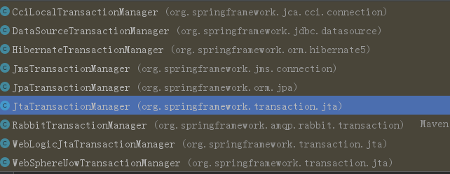

#Mybatis


```java

```


`SqlSessionFactoryBuilder`

通过字节流或字符流加载.xml配置文件，并解析，生成   `SqlSessionFactory接口`的实现类

```java
/**
 *    Copyright 2009-2016 the original author or authors.
 *
 *    Licensed under the Apache License, Version 2.0 (the "License");
 *    you may not use this file except in compliance with the License.
 *    You may obtain a copy of the License at
 *
 *       http://www.apache.org/licenses/LICENSE-2.0
 *
 *    Unless required by applicable law or agreed to in writing, software
 *    distributed under the License is distributed on an "AS IS" BASIS,
 *    WITHOUT WARRANTIES OR CONDITIONS OF ANY KIND, either express or implied.
 *    See the License for the specific language governing permissions and
 *    limitations under the License.
 */
package org.apache.ibatis.session;

import java.io.IOException;
import java.io.InputStream;
import java.io.Reader;
import java.util.Properties;

import org.apache.ibatis.builder.xml.XMLConfigBuilder;
import org.apache.ibatis.exceptions.ExceptionFactory;
import org.apache.ibatis.executor.ErrorContext;
import org.apache.ibatis.session.defaults.DefaultSqlSessionFactory;

/**
 * Builds {@link SqlSession} instances.
 *
 * @author Clinton Begin
 */
public class SqlSessionFactoryBuilder {

  public SqlSessionFactory build(Reader reader) {
    return build(reader, null, null);
  }

  public SqlSessionFactory build(Reader reader, String environment) {
    return build(reader, environment, null);
  }

  public SqlSessionFactory build(Reader reader, Properties properties) {
    return build(reader, null, properties);
  }

  /* 字符流方式加载配置文件的最终调用该方法
  *  解析xml配置文件，生成SqlSessionFactory
  */
  public SqlSessionFactory build(Reader reader, String environment, Properties properties) {
    try {
      XMLConfigBuilder parser = new XMLConfigBuilder(reader, environment, properties);
      return build(parser.parse());
    } catch (Exception e) {
      throw ExceptionFactory.wrapException("Error building SqlSession.", e);
    } finally {
      ErrorContext.instance().reset();
      try {
        reader.close();
      } catch (IOException e) {
        // Intentionally ignore. Prefer previous error.
      }
    }
  }

  public SqlSessionFactory build(InputStream inputStream) {
    return build(inputStream, null, null);
  }

  public SqlSessionFactory build(InputStream inputStream, String environment) {
    return build(inputStream, environment, null);
  }

  public SqlSessionFactory build(InputStream inputStream, Properties properties) {
    return build(inputStream, null, properties);
  }
  // 字节流方式加载配置文件的最终会调用该方法
  public SqlSessionFactory build(InputStream inputStream, String environment, Properties properties) {
    try {
      XMLConfigBuilder parser = new XMLConfigBuilder(inputStream, environment, properties);
      return build(parser.parse());
    } catch (Exception e) {
      throw ExceptionFactory.wrapException("Error building SqlSession.", e);
    } finally {
      ErrorContext.instance().reset();
      try {
        inputStream.close();
      } catch (IOException e) {
        // Intentionally ignore. Prefer previous error.
      }
    }
  }
    
  public SqlSessionFactory build(Configuration config) {
    return new DefaultSqlSessionFactory(config);
  }

}

```


`SqlSessionFactory:`

```java
public interface SqlSessionFactory {
  // 开启一个回话：默认事务手动提交
  SqlSession openSession();
  // 开启一个会话：可设置事务提交方式：true:自动
  SqlSession openSession(boolean autoCommit);
  SqlSession openSession(Connection connection);
  SqlSession openSession(TransactionIsolationLevel level);

  SqlSession openSession(ExecutorType execType);
  SqlSession openSession(ExecutorType execType, boolean autoCommit);
  SqlSession openSession(ExecutorType execType, TransactionIsolationLevel level);
  SqlSession openSession(ExecutorType execType, Connection connection);

  Configuration getConfiguration();

}
```


`SqlSession`

* 提供一些CRUD接口
* 事务操作
* 获取接口的代理 【最常用的】
* 获取当前配置
* 获取当前连接

```java
package org.apache.ibatis.session;

import java.io.Closeable;
import java.sql.Connection;
import java.util.List;
import java.util.Map;

import org.apache.ibatis.cursor.Cursor;
import org.apache.ibatis.executor.BatchResult;

/**
 * The primary Java interface for working with MyBatis.
 * Through this interface you can execute commands, get mappers and manage transactions.
 *
 * @author Clinton Begin
 */
public interface SqlSession extends Closeable {
   // sql操作接口...增删改查
  <T> T selectOne(String statement, Object parameter);
    
   // 事务有关操作
  void commit();
  // 设置是否强制提交事务
  void commit(boolean force);
  void rollback();
  void rollback(boolean force);
  // 获取当前配置
  Configuration getConfiguration();

  /**
    获取接口的代理
   * Retrieves a mapper.
   * @param <T> the mapper type
   * @param type Mapper interface class
   * @return a mapper bound to this SqlSession
   */
  <T> T getMapper(Class<T> type);
  // 获取当前连接
  Connection getConnection();
}
```


###环境搭建：

**主要配置数据源，事务，session**

* `DataSource` : 
* `SqlSessionFactoryBean`
* `Transactional`

####1.原生

```java
...
// 1.读取配置文件
String resource = "mybatis-config.xml"; 
InputStream inputStream = Resources.getResourceAsStream(resource);
// 2.根据配置文件创建SqlsessionFactoryBean
SqlSessionFactory sqlSessionFactory = new SqlSessionFactoryBuilder().build(inputStream); 
// 3.开启SqlSession
SqlSession session = sqlSessionFactory.openSession();  
try {    
    // 4.获取Mapper代理
      EmployeeMapper mapper = session.getMapper(EmployeeMapper.class);   
    // 5.调用方法
      mapper.addEmp(employee);        
    // 6.事务提交（mybatis原生默认手动提交）
      session.commit();  
} finally {
   session.close();  
   inputStream.close();
}
```


#### 2.xml方式

```xml
<?xml version="1.0" encoding="UTF-8"?>
        <beans xmlns="http://www.springframework.org/schema/beans"
               xmlns:xsi="http://www.w3.org/2001/XMLSchema-instance"
               xmlns:context="http://www.springframework.org/schema/context"
               xmlns:aop="http://www.springframework.org/schema/aop"
               xmlns:tx="http://www.springframework.org/schema/tx"
               xsi:schemaLocation="http://www.springframework.org/schema/beans
	http://www.springframework.org/schema/beans/spring-beans.xsd
	http://www.springframework.org/schema/context
	http://www.springframework.org/schema/context/spring-context.xsd
	http://www.springframework.org/schema/aop
	http://www.springframework.org/schema/aop/spring-aop.xsd
	http://www.springframework.org/schema/tx
	http://www.springframework.org/schema/tx/spring-tx.xsd">

        <!--1.引入数据源配置文件-->
        <!--方式1：-->
        <context:property-placeholder location="classpath:jdbc.properties,classpath:redis.properties"/>
        <!--方式2: -->
        <!--<bean id="propertyConfigurer" class="org.springframework.beans.factory.config.PropertyPlaceholderConfigurer">-->
                <!--<property name="location" value="classpath:jdbc.properties" />-->
        <!--</bean>-->

        <!--注意：没有扫描mapper接口-->
        <context:component-scan base-package="service"/>
        <!--<context:component-scan base-package="mapper"/>-->


        <!--2.配置数据源：阿里的druid连接池-->
        <bean id="druidDataSource" class="com.alibaba.druid.pool.DruidDataSource">
                <property name="driverClassName" value="${jdbc.driver}"/>
                <property name="url" value="${jdbc.url}"/>
                <property name="username" value="${jdbc.username}"/>
                <property name="password" value="${jdbc.password}"/>
        </bean>

        <!--3.配置spring 管理mybatis 的 SqlSessionFactoryBean；注入数据源-->
        <bean id="sqlSessionFactory" class="org.mybatis.spring.SqlSessionFactoryBean">
                <property name="dataSource" ref="druidDataSource"/>
                <!--指定mybatis全局配置文件的位置-->
                <property name="configLocation" value="classpath:mybatis/mybatis-config.xml"/>
                <!--指定实体映射配置位置: 路径上**迭代查找：可在全局配置中配置-->
                <property name="mapperLocations" value="classpath:mybatis/mapper/*.xml"/>
                <!--配置实体类别名：可在全局配置中配置-->
                <!--<property name="typeAliasesPackage" value="pojo"/>-->
                <!-- 传入PageHelper的插件 -->
                <property name="plugins">
                        <array>
                                <bean class="com.github.pagehelper.PageInterceptor">
                                        <property name="properties">
                                                <props>
                                                        <prop key="helperDialect">mysql</prop>
                                                        <prop key="reasonable">true</prop>
                                                </props>
                                        </property>
                                </bean>
                        </array>
                </property>
        </bean>

        <!--4.扫描dao接口,目的是生成代理对象 -->
        <bean id="mapperScanner" class="org.mybatis.spring.mapper.MapperScannerConfigurer">
                <property name="basePackage" value="mapper"/>
        </bean>

        <!--5.配置Spring事务管理 -->
        <!--5.1 配置事务管理器 -->
        <bean id="transactionManager" class="org.springframework.jdbc.datasource.DataSourceTransactionManager">
                <property name="dataSource" ref="druidDataSource"/>
        </bean>

        <!--AOP方式-->
        <!-- 配置事务的通知-->
    <tx:advice id="txAdvice" transaction-manager="transactionManager">
        <!-- 配置事务的属性
                isolation：用于指定事务的隔离级别。默认值是DEFAULT，表示使用数据库的默认隔离级别。
                propagation：用于指定事务的传播行为。默认值是REQUIRED，表示一定会有事务，增删改的选择。查询方法可以选择SUPPORTS。
                read-only：用于指定事务是否只读。只有查询方法才能设置为true。默认值是false，表示读写。
                timeout：用于指定事务的超时时间，默认值是-1，表示永不超时。如果指定了数值，以秒为单位。
                rollback-for：用于指定一个异常，当产生该异常时，事务回滚，产生其他异常时，事务不回滚。没有默认值。表示任何异常都回滚。
                no-rollback-for：用于指定一个异常，当产生该异常时，事务不回滚，产生其他异常时事务回滚。没有默认值。表示任何异常都回滚。
        -->
        <tx:attributes>
            <tx:method name="*" propagation="REQUIRED" read-only="false"/>
            <tx:method name="find*" propagation="SUPPORTS" read-only="true"></tx:method>
        </tx:attributes>
    </tx:advice>

    <!-- 配置aop-->
    <aop:config>
        <!-- 配置切入点表达式-->
        <aop:pointcut id="pt1" expression="execution(* com.itheima.service.impl.*.*(..))"></aop:pointcut>
        <!--建立切入点表达式和事务通知的对应关系 -->
        <aop:advisor advice-ref="txAdvice" pointcut-ref="pt1"></aop:advisor>
    </aop:config>

        <!--5.2 声明式：事务注解支持-->
        <tx:annotation-driven transaction-manager="transactionManager"/>
</beans>
```

`Tips:`

​	后面的事务，可以替换成AOP方式，实现完全XML方式

​	AOP方式：需要配置切面和切入点表达式

​	`AOP：也可以结合Aspect jar 注解+切面类实现AOP编程：如记录日志，，，`

​	注解式：配置完事务管理器后，再配置个注解事务支持，然后，在类上使用`@Transactional` 注解即可

​	  

#####`SqlSessionFactoryBean`

> pacakge：`org.mybatis.spring`

* 数据源: `DataSource`

* 全局配置文件位置 : `Resource configuration`
* 实体类映射配置位置 : `Resource[] mapperLocations`
* 别名 : `Class<?>[] typeAliases ` 或  `String typeAliasesPackage`
* 插件：如PageHelper  : `Interceptor[] plugins`


```java
package org.mybatis.spring;

public class SqlSessionFactoryBean implements FactoryBean<SqlSessionFactory>, InitializingBean, ApplicationListener<ApplicationEvent> {

  private static final Log LOGGER = LogFactory.getLog(SqlSessionFactoryBean.class);

  /*mybatis全局配置文件:【常用】
  Set the location of the MyBatis {@code SqlSessionFactory} config file. A typical value is
   * "WEB-INF/mybatis-configuration.xml".
  */   
  private Resource configLocation;
 
  /*
  	Set a customized MyBatis configuration.
  */  
  private Configuration configuration;
  // 实体类映射文件
  private Resource[] mapperLocations;
  // 数据源
  private DataSource dataSource;
  // 事务
  private TransactionFactory transactionFactory;
  
  private Properties configurationProperties;

  private SqlSessionFactoryBuilder sqlSessionFactoryBuilder = new SqlSessionFactoryBuilder();

  private SqlSessionFactory sqlSessionFactory;

  //EnvironmentAware requires spring 3.1
  private String environment = SqlSessionFactoryBean.class.getSimpleName();

  private boolean failFast;
  // 插件：如PageHelper
  private Interceptor[] plugins;

  private TypeHandler<?>[] typeHandlers;

  private String typeHandlersPackage;
  // 实体类别名：实体类字节码数组
  private Class<?>[] typeAliases;
  // 实体类别名：实体类所在包
  private String typeAliasesPackage;

  private Class<?> typeAliasesSuperType;

  //issue #19. No default provider.
  private DatabaseIdProvider databaseIdProvider;

  private Class<? extends VFS> vfs;

  private Cache cache;

  private ObjectFactory objectFactory;

  private ObjectWrapperFactory objectWrapperFactory;
}
```


#####`MapperScannerConfigurer`

* 扫描实体类对应的  `Mapper接口`, 并自动注册为bean ( 不需要单独使用spring注解扫描了)
  * `String basePackage;` : 要扫描的Mapper接口所在包

```java
package org.mybatis.spring.mapper;
public class MapperScannerConfigurer implements BeanDefinitionRegistryPostProcessor, InitializingBean, ApplicationContextAware, BeanNameAware {

  private String basePackage;

  private boolean addToConfig = true;

  private SqlSessionFactory sqlSessionFactory;

  private SqlSessionTemplate sqlSessionTemplate;

  private String sqlSessionFactoryBeanName;

  private String sqlSessionTemplateBeanName;

  private Class<? extends Annotation> annotationClass;

  private Class<?> markerInterface;

  private ApplicationContext applicationContext;

  private String beanName;

  private boolean processPropertyPlaceHolders;

  private BeanNameGenerator nameGenerator;
  
  // getter and setter
}

```


#####`DataSourceTransactionManager`

>package ：`org.springframework.jdbc.datasource`

```java
package org.springframework.jdbc.datasource;

public class DataSourceTransactionManager extends AbstractPlatformTransactionManager implements ResourceTransactionManager, InitializingBean {
    @Nullable
    private DataSource dataSource;
    private boolean enforceReadOnly;
    // 构造，getter 和 setter
    
    // 一些和事务相关的操作
}
```

Tips:

​	JPA用的是      `JpaTransactionManager`，二者都继承于     `AbstractPlatformTransactionManager`类

​         `AbstractPlatformTransactionManager`,其非抽象子类，都是一些事务相关的类



#### 3.配置类方式


####4.注解方式


```xml

```


#### 总结:

​	**三者可以相互结合。根据需求，来选择搭建方式，或专一或复合**

***

###配置文件：

####1.全局配置文件


***

####2.mybatis实体类映射文件

**作用：**

​	关联mapper接口与实体类，生成接口的    **`代理对象`**，编写对应方法的sql语句

**示例：**

```xml
<?xml version="1.0" encoding="UTF-8" ?>
<!DOCTYPE mapper PUBLIC "-//mybatis.org//DTD Mapper 3.0//EN" "http://mybatis.org/dtd/mybatis-3-mapper.dtd" >
<mapper namespace="mapper.GoodsMapper">
    <!--配置字段和属性的映射关系-->
    <resultMap id="baseResultMap" type="goods">
        <id column="id" property="id" jdbcType="INTEGER"/>
        <result column="goods_name" property="goodsName" jdbcType="VARCHAR"/>
        <result column="title" property="title" jdbcType="VARCHAR"/>
        <result column="price" property="price" jdbcType="DECIMAL"/>
        <result column="count" property="count" jdbcType="INTEGER"/>
        <result column="status" property="status" jdbcType="INTEGER"/>
        <result column="goodsDesc" property="goodsdesc" jdbcType="VARCHAR"/>
        <result column="isDelete" property="isdelete" jdbcType="INTEGER"/>
        <result column="create_time" property="createTime" jdbcType="TIMESTAMP"/>
        <result column="update_time" property="updateTime" jdbcType="TIMESTAMP"/>
    </resultMap>
    <select id="findAll" resultType="goods">
        SELECT * FROM goods
    </select>
    <insert id="saveGoods" parameterType="goods">
        INSERT INTO goods (goods_name,title,price,goodsDesc) VALUES (#{goodsName},#{title},#{price},#{goodsdesc})
    </insert>
    <insert id="save" parameterType="Map">
        INSERT INTO goods (goods_name,title,price,goodsDesc) VALUES (#{cs.goodsName},#{cs.title},#{cs.price},#{cs.goodsdesc})
    </insert>

    <select id="findOneById" parameterType = "int" resultMap="baseResultMap">
        SELECT * FROM goods WHERE id = #{id}
    </select>
</mapper>
```

##### 常用标签与属性：

1. `<mapper>`：标签

```
功能：实体类映射配置的主标签，在其标签体中定义其他标签。
属性：
	namespace:
		功能：
			1.唯一标识一个mapper接口：可能有多个重名方法，此时可通过命名空间.方法的形式，精准匹配
		值  : mapper接口的全限定类名
```

2. `<select>`  / `<update>`  / `<insert>` / `<delete>`：标签

```
功能：对数据进行增删改查
属性：
	id ：匹配mapper接口中的方法名(严格一致)
	resultType:返回值类型
	resultMap:返回值类型
	(二选一)
	parameterType:参数类型（基本类型，字符串，对象，Map...）
	...
```

`tips:`

​	在具体的sql语句中，resultMap和resultType 二选一使用

3.  `resultType`: 属性

```
功能：返回值类型:基本类型、String和对象
使用：
	结合CRUD标签使用
```

4. `resultMap`: 标签

```
功能：
	1.建立字段和属性的映射关系
	2.返回值类型
	结合CRUD标签使用
子标签：
	<id>:映射主键
	<result>：映射非注解字段
	<一对多>
	<多对多>
```

```xml
<resultMap id="BaseResultMap" type="com.wxss.shop.pojo.Goods" >
  <!--配置后，默认别名为类名：首字母小写，后续不变-->
<!--<resultMap id="BaseResultMap" type="goods" >-->
    <id column="id" property="id" jdbcType="INTEGER" />
    <result column="goods_name" property="goodsName" jdbcType="VARCHAR" />
    <result column="title" property="title" jdbcType="VARCHAR" />
    <result column="price" property="price" jdbcType="DECIMAL" />
    <result column="count" property="count" jdbcType="INTEGER" />
    <result column="status" property="status" jdbcType="INTEGER" />
    <result column="goodsDesc" property="goodsdesc" jdbcType="VARCHAR" />
    <result column="isDelete" property="isdelete" jdbcType="INTEGER" />
    <result column="create_time" property="createTime" jdbcType="TIMESTAMP" />
    <result column="update_time" property="updateTime" jdbcType="TIMESTAMP" />
</resultMap>
<!--windows系统中上面的商品名，不区分大小写，但下面的商品名区分大小写-->
<insert id="save" parameterType="Map">
	INSERT INTO 
		goods (goods_name,title,price,goodsDesc) 
    <!--报错-->
    VALUES (#{cs.goodsname},#{cs.title},#{cs.price},#{cs.goodsdesc})
    <!--正确-->
    VALUES (#{cs.goodsName},#{cs.title},#{cs.price},#{cs.goodsdesc})
</insert>
```

当调用上述方法时，因为实体类中没有goodsname(区分大小写)属性，所以找不到getter方法，会报：

`There is no getter for property named 'goodsname' in 'class pojo.Goods'`

`tips：`

​	虽然windows不区分大小写，我们可以在<result>标签内，忽略大小写的问题，但是在下面的DML语句中，==参数为对象时，占位符中的属性必须和对象的属性名严格保持一致（区分大小写）==，否则会报找不到getter方法

所以，最好的方式，是编码时，严格按照区分大小写。

##### 字段与属性映射：

如果实体类的属性名和数据库中表的字段名不一致，需要创建映射关系，否则不一致的属性会当做null处理。

```json
# 数据库中商品名的字段为:goods_name,而实体中对应的属性名为goodsName：不一致，当做null处理
{
    "id":1,
    "goodsName":null, 
    "title":"新品促销",
    "price":4399.00,
    "count":100,
    "status":0,
    "goodsdesc":"联想笔记本新品",
    "isdelete":0,
    "createTime":null,
    "updateTime":null
},
```

**解决属性和字段不一致的方式：**

​	1.创建实体类时，属性名和字段严格保持一致

​	2.SQL语句中使用别名的方式来匹配不一致的属性:   `goods_name as goodsName`

​	3.使用   `<ResultMap>`标签在实体类的映射配置文件中声明属性和字段的映射关系

`tips:`

1. 别名的效率最高，但比较麻烦
1. `<ResultMap>`

***

 ##### 参数的占位符：

1.`#{index}` :指定参数的索引,  **`（从0开始）`**

2.`#{param1}`:指定参数的位置：**`param`**是固定值，1是位置：**`（从1开始）`**

3.**参数为对象时:只能通过#{属性名}**通过实体类的  **get/set方法**来获取和设置值，（==OGNL表达式==）

4.**参数是Map类型时:**

​	如果**value是基本类型或者String**,使用**#{key}**

​	如果**value是对象**，需要使用 **#{key.对象的属性}** 

```xml
<!--Java代码：
	Goods goods = new Goods();
	// setter
	Map.put("cs",goods);
-->
<insert id="save" parameterType="Map">
	INSERT INTO 
		goods	(goods_name,title,price,goodsDesc) 
	VALUES 
		(#{cs.goodsName},#{cs.title},#{cs.price},#{cs.goodsdesc})
</insert>
```

`tips:`

​	只有     `一个参数，且是基本类型或者String时`，占位符内的内容随意

​	参数是对象时，需要提供属性的   `getter/setter`方法

5.**${}和#{}的区别：**

```
1.${}底层，使用字符串拼接的方式，不支持基本类型和String类型的索引方式：

		${0} --->会直接将0拼接到sql语句中

2.#{}底层，使用的占位符，支持索引，和复杂类型----【推荐#{}】

		#{0} --->占位符，代表第一个参数

参数是对象时二者用法一致：如user(配置过别名)
	#{id}
	${id}

	org.apache.ibatis.reflection.ReflectionException: There is no getter for property named 'goods' in 'class pojo.Goods'

	org.apache.ibatis.reflection.ReflectionException: There is no getter for property named 'goodsDesc' in 'class pojo.Goods'
```

​	

```xml

<insert id="save" parameterType="goods">
     INSERT INTO 
    	goods 
    	(goods_name,title,price,goodsDesc) 
     VALUES 
    	<!--错误写法-->
    	(#{goods.goodsName},#{goods.title},#{goods.price},#{goods.goodsdesc})
    	<!--正确写法-->
         (#{goosName},#{title},#{price},#{goodsdesc})
</insert>
```

**会报异常：**

`org.apache.ibatis.reflection.ReflectionException: There is no getter for property named 'goods' in 'class pojo.Goods'`

**而且，如果没有提供对应属性的getter方法，也会报上述异常**

**mapper接口中的方法不能重载:**

`[F:\ideaWorkPlace\anonymousP\springdemo\target\classes\mybatis\mapper\GoodsMapper.xml]'; `

`nested exception is org.apache.ibatis.builder.BuilderException: `

​	`Error parsing Mapper XML. Cause: java.lang.IllegalArgumentException: `

​		`Mapped Statements collection already contains value for mapper.GoodsMapper.save`

***

**动态sql语句：**


***


###高级应用：

####复杂查询：

#####1.关联查询：

#####2.分页查询：

######使用pageHelper插件：

​	**1.配置PageHelper插件**

​	**2.在程序中使用：PageHelper.startPage(int page ,int size)方法即可**

`tips：`

​	必须保证   `PageHelper.startPage(page,size);`语句后的**下一条语句** 是**mybatis查询方法**，否则出错

**编码:**

```java
  @Override
    public List<Goods> findAllByPage(int page,int size) {
        // 设置分页信息
        PageHelper.startPage(page,size);
        // 必须保证查询语句紧跟其后size=2
        List<Goods> goodsList = goodsMapper.findAll();
        PageInfo<Goods> pageInfo = new PageInfo<Goods>(goodsList);
        System.out.println("size="+pageInfo.getSize()); // 每页显示
        System.out.println("total"+pageInfo.getTotal()); // 总记录数
        System.out.println("nextPage"+pageInfo.getNextPage()); // 下一页
        System.out.println("PageNum"+pageInfo.getPageNum()); // 当前页
        System.out.println("getPages"+pageInfo.getPages()); // ？

        return pageInfo.getList();
    }
```

**配置PageHelper插件：**

可以在mybatis全局配置中配置PageHelper插件，也可以在spring整合mybatis的配置文件中配置PageHelper：

**方式1：mybatis全局配置：**

```xml
<?xml version="1.0" encoding="UTF-8"?>
<!DOCTYPE configuration PUBLIC "-//mybatis.org//DTD Config 3.0//EN" "http://mybatis.org/dtd/mybatis-3-config.dtd">
<configuration>
    <!--实体类别名-->
    <typeAliases>
        <!--设置一个类的别名-->
        <!--<typeAlias type="pojo.Goods" alias="goods"/>-->
        <!--设置一个包下所有的实体类的别名：默认类名首字母小写-->
        <package name="pojo"/>
    </typeAliases>

    <!--PageHelper插件-->
    <plugins>
        <plugin interceptor="com.github.pagehelper.PageHelper">
            <property name="dialect" value="mysql"/>
            <property name="offsetAsPageNum" value="false"/>
            <property name="rowBoundsWithCount" value="false"/>
            <property name="pageSizeZero" value="true"/>
            <property name="reasonable" value="false"/>
            <property name="supportMethodsArguments" value="false"/>
            <property name="returnPageInfo" value="none"/>
        </plugin>
    </plugins>
</configuration>
```

**方式2：整合配置文件：**

```xml
<?xml version="1.0" encoding="UTF-8"?>
<beans xmlns="http://www.springframework.org/schema/beans"
       xmlns:xsi="http://www.w3.org/2001/XMLSchema-instance"
       xmlns:context="http://www.springframework.org/schema/context"
       xmlns:aop="http://www.springframework.org/schema/aop"
       xmlns:tx="http://www.springframework.org/schema/tx"
       xsi:schemaLocation="http://www.springframework.org/schema/beans
	http://www.springframework.org/schema/beans/spring-beans.xsd
	http://www.springframework.org/schema/context
	http://www.springframework.org/schema/context/spring-context.xsd
	http://www.springframework.org/schema/aop
	http://www.springframework.org/schema/aop/spring-aop.xsd
	http://www.springframework.org/schema/tx
	http://www.springframework.org/schema/tx/spring-tx.xsd">

        <!--1.引入数据源配置文件-->
        <!--方式1：-->
        <context:property-placeholder location="classpath:jdbc.properties"/>
        <!--方式2: -->
        <!--<bean id="propertyConfigurer" class="org.springframework.beans.factory.config.PropertyPlaceholderConfigurer">-->
                <!--<property name="location" value="classpath:jdbc.properties" />-->
        <!--</bean>-->


        <context:component-scan base-package="service"/>
        <!--<context:component-scan base-package="mapper"/>-->


        <!--2.配置数据源：阿里的druid连接池-->
        <bean id="druidDataSource" class="com.alibaba.druid.pool.DruidDataSource">
                <property name="driverClassName" value="${jdbc.driver}"/>
                <property name="url" value="${jdbc.url}"/>
                <property name="username" value="${jdbc.username}"/>
                <property name="password" value="${jdbc.password}"/>
        </bean>

        <!--3.配置spring 管理mybatis 的 SqlSessionFactoryBean；注入数据源-->
        <bean id="sqlSessionFactory" class="org.mybatis.spring.SqlSessionFactoryBean">
                <property name="dataSource" ref="druidDataSource"/>
                <!--指定mybatis全局配置文件的位置-->
                <property name="configLocation" value="classpath:mybatis/mybatis-config.xml"/>
                <!--指定实体映射配置位置: 路径上**迭代查找：可在全局配置中配置-->
                <property name="mapperLocations" value="classpath:mybatis/mapper/*.xml"/>
                <!--配置实体类别名：可在全局配置中配置-->
                <!--<property name="typeAliasesPackage" value="pojo"/>-->
                <!-- 传入PageHelper的插件 -->
                <property name="plugins">
                        <array>
                                <bean class="com.github.pagehelper.PageInterceptor">
                                        <property name="properties">
                                                <props>
                                                        <prop 	                                                                                      key="helperDialect">mysql</prop>
                                                        <prop key="reasonable">true</prop>
                                                </props>
                                        </property>
                                </bean>
                        </array>
                </property>
        </bean>

        <!--4.扫描dao接口,目的是生成代理对象 -->
        <bean id="mapperScanner" class="org.mybatis.spring.mapper.MapperScannerConfigurer">
                <property name="basePackage" value="mapper"/>
        </bean>

        <!--5.配置Spring的声明式事务管理 -->
        <!--5.1 配置事务管理器 -->
        <bean id="transactionManager" class="org.springframework.jdbc.datasource.DataSourceTransactionManager">
                <property name="dataSource" ref="druidDataSource"/>
        </bean>

        <!--5.2 事务注解支持-->
        <tx:annotation-driven transaction-manager="transactionManager"/>

</beans>
```

`tips:`

​	上述配置文件中，mapperScanner，扫描dao接口，不但生成接口的代理对象，而且还将接口放入容器中

即,不用再单独配置:扫描dao接口所在包，

#####3.条件查询：

***

####缓存：


***

####延迟加载与立即加载：

***
####事务：

mybatis默认关闭了JDBC的自动提交功能。即每一个SqlSession默认是不会自动提交事务

开启方式：

​	自动提交： `openSession(true)`

​	手动提交： `session.commit()`

***

