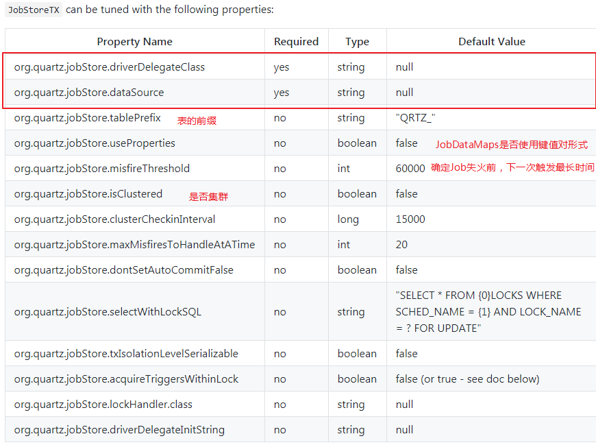
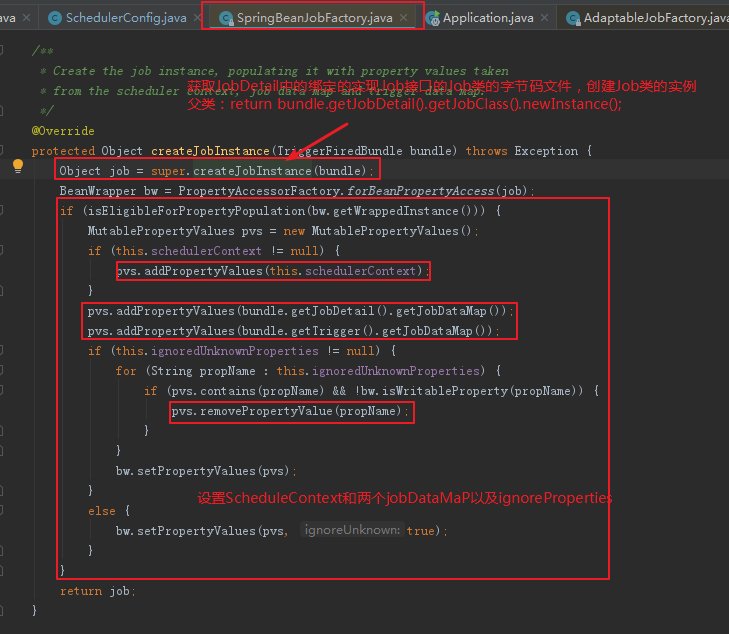

# Quartz


Schedule

​	调度

Trigger

​	触发时间

Job

​	执行具体逻辑


***

```java
package test;

import com.how2java.example2.PrintJob;
import org.junit.Test;
import org.quartz.JobDetail;
import org.quartz.Scheduler;
import org.quartz.SchedulerException;
import org.quartz.Trigger;

import static org.quartz.JobBuilder.newJob;
import static org.quartz.TriggerBuilder.newTrigger;
import static org.quartz.SimpleScheduleBuilder.simpleSchedule;
import org.quartz.impl.StdSchedulerFactory;

/**
 * Author:Created by wx on 2019/6/19
 * Desc:
 */
public class QuartzTests {

    public void call(Class jobClass,int intervalSeconds,int repeatCount,int sleepSeconds){
        try {
            // 1.创建调度器
            Scheduler scheduler = StdSchedulerFactory.getDefaultScheduler();
            // 2.创建触发器
            Trigger trigger = newTrigger()
                    .withIdentity("T1", "trigger_group1")
                    .startNow()
                    .withSchedule(
              			simpleSchedule()
                 		.withIntervalInSeconds(intervalSeconds)
                 		.withRepeatCount(repeatCount))
                    .build();
            // 3.定义JobDetail
            JobDetail jobDetail = newJob(jobClass) //指定干活的类MailJob
                    .withIdentity("J1", "printJob_group1") //定义任务名称和分组
                    .usingJobData("text", "Are you ok ?") //定义属性
                    .build();
            // 4.由调度器绑定job和触发器
            scheduler.scheduleJob(jobDetail, trigger);
            // 5.启动job
            scheduler.start();
		   // 休眠一段时间，等待Job执行完毕
            Thread.sleep(sleepSeconds);
            // 6.等待所有Job执行结束后，关闭
            scheduler.shutdown(true);
        } catch (SchedulerException | InterruptedException e) {
            e.printStackTrace();
        }
    }
    
    @Test
    public void testExample2(){
        call(PrintJob.class, 2, 3, 20000);
    }

}

```


## Job

* 和具体的业务逻辑有关，通常由三部分组成：

  * >Job 其实是由 3 个部分组成： 
    >
    >JobDetail: 用于描述这个Job是做什么的 ，
    >实现Job的类: 具体干活的 
    >JobDataMap: 给 Job 提供参数用的 

* 和Trigger一样，Job也有name和group==（Jobkey = group.name,唯一标识）==

* ==Quartz中由JobDetail定义Job==

* ==Job类必须实现Job接口或者InterruptableJob接口==

`tips:`

​	InterruptableJob接口继承于Job接口，增加了一个Interrupt方法

```java
public interface InterruptableJob extends Job {
    // 当job被中断时，会调用该方法
    void interrupt()
        throws UnableToInterruptJobException;
}
```


### `JobDetail`

* 为给定的Job设置属性（properties）
* 由  `JobBuilder`创建

常用API：

```java
public JobKey getKey();   			// 获取JobKey
public String getDescription();      // 获取设置的描述信息
public Class<? extends Job> getJobClass(); // 获取实现Job接口的类
public JobDataMap getJobDataMap();		  // 获取及设置Job参数
```

`tips:`

​	==**JobDetail的JobDataMap和Trigger的JobDataMap不是同一个Map**==

### `JobExecutionContext`

​	Job有关上下文

```java
public void execute(JobExecutionContext context) throws JobExecutionException {
    Date previousFireTime = context.getPreviousFireTime(); // 上次执行时间
    Date fireTime = context.getFireTime();// 此次执行时间
    Date nextFireTime = context.getNextFireTime();// 下次执行时间
    Date scheduledFireTime = context.getScheduledFireTime();//与此次执行时间相同
    
    JobDetail jobDetail =  context.getJobDetail(); // 获取JobDetail，进而获取Map参数
    JobDataMap jobDataMapOfDetail = jobDetail.getJobDataMap(); // 获取detail中的Map
    
    JobDataMap jobDataMapOfAll = context getMergedJobDataMap();// 获取JobDetail+trigger中的Map
    
}

```

***


***

### `JobKey:`

​	JobKey与JobDetail设置的   `withIdentity("J1"，"group1")`有关 

```
JobKey key = jobDetail.getKey();  // groub1.J1
```

***

### JobExecutionException与异常

在执行job时，可能会出现异常。通过  `JobExecutionException` 来处理：	

1.  停止调度

   ```java
   // 该代码位于实现Job接口类的excute（）方法内
   try{
     int a = 2/0;    
   }catch(Exception e){
      JobExecutionException jobException = new JobExecutionException(e);
      // 方式1：qurtz会自动停止调度与该Job关联的所有触发器
      jobException.setUnscheduleAllTriggers(true); // 停止调度未执行
   }
   ```

2. ：重新执行

   ```java
   try{
     int a = 2/0;    
   }catch(Exception e){
      JobExecutionException jobException = new JobExecutionException(e);
      // 该Job会立即重新执行
      jobException.refireImmediately();
   }
   ```

`tips:`

1. 默认情况，在执行job时，某一次发生异常后，后续的仍会执行
2. 但使用`jobException.setUnscheduleAllTriggers(true); `后，后续的不会再执行

***

### @PersistJobDataAfterExecution


### @DisallowConcurrentExecution与并发

默认情况，job会按照预设的频率执行，不会因上一次任务未执行结束而等待。

但有时必须前一次执行完成，才能执行下一次，可在job类上使用  `@DisallowConcurrentExecution`

```java
package com.how2java.example2;

import com.how2java.DateFormat;
import org.quartz.*;
import org.slf4j.Logger;
import org.slf4j.LoggerFactory;

import java.util.Date;

/**
 * Author:Created by wx on 2019/6/19
 * Desc:
 */
@DisallowConcurrentExecution
public class PrintJob implements Job {
    private Logger log = LoggerFactory.getLogger(PrintJob.class);

    @Override
    public void execute(JobExecutionContext context) throws JobExecutionException {


        // 获取参数
        Date previousFireTime = context.getPreviousFireTime();
        Date fireTime = context.getFireTime();
        Date nextFireTime = context.getNextFireTime();
        JobDetail jobDetail = context.getJobDetail();

        System.out.println("上次执行时间："+DateFormat.formateDate(previousFireTime));
        System.out.println("此次执行时间："+DateFormat.formateDate(fireTime));
        System.out.println("下次执行时间："+DateFormat.formateDate(nextFireTime));

        System.out.println("****************************");
        Class<? extends Job> jobClass = jobDetail.getJobClass();
        assert jobClass == PrintJob.class;

        try { //休眠5秒
            Thread.sleep(5000);
        } catch (InterruptedException e) {
            // TODO Auto-generated catch block
            e.printStackTrace();
        }
    }
}

```

执行结果：

```
上次执行时间：null
此次执行时间：2019-06-19 15:19:54
下次执行时间：2019-06-19 15:19:56
****************************
上次执行时间：2019-06-19 15:19:54
此次执行时间：2019-06-19 15:19:59
下次执行时间：2019-06-19 15:19:58
****************************
上次执行时间：2019-06-19 15:19:56
此次执行时间：2019-06-19 15:20:04
下次执行时间：2019-06-19 15:20:00
****************************
上次执行时间：2019-06-19 15:19:58
此次执行时间：2019-06-19 15:20:09
下次执行时间：null
****************************
```

`tips:`

​	1.startNow()会立即执行，此次执行不计入repeatCount

​	2.虽然    `@DisallowConcurrentExecution` 会让job同步执行，但上次/下次执行时间仍然按照预设频率确定

***

### 中断：

​	中断执行的job，被中断的job类必须实现       `InterruptableJob`,而不是  `Job`，否则报错：

```properties
org.quartz.UnableToInterruptJobException: Job printJob_group1.J1 can not be interrupted, since it does not implement org.quartz.InterruptableJob
```

修改PrintJob类：

```java
package com.how2java.concurrent;

import com.how2java.DateFormat;
import org.quartz.*;
import org.slf4j.Logger;
import org.slf4j.LoggerFactory;

import java.util.Date;

/**
 * Author:Created by wx on 2019/6/19
 * Desc:
 */
@DisallowConcurrentExecution
public class PrintJob implements InterruptableJob {
    private Logger log = LoggerFactory.getLogger(PrintJob.class);

    @Override
    public void execute(JobExecutionContext context) throws JobExecutionException {


        // 获取参数
        Date previousFireTime = context.getPreviousFireTime();
        Date fireTime = context.getFireTime();
        Date nextFireTime = context.getNextFireTime();
        JobDetail jobDetail = context.getJobDetail();
        JobKey key = jobDetail.getKey();

        System.out.println("上次执行时间："+DateFormat.formateDate(previousFireTime));
        System.out.println("此次执行时间："+DateFormat.formateDate(fireTime));
        System.out.println("下次执行时间："+DateFormat.formateDate(nextFireTime));
        System.out.println("jobKey:"+key);
        System.out.println("****************************");
        Class<? extends Job> jobClass = jobDetail.getJobClass();
        assert jobClass == PrintJob.class;

        try { //休眠5秒
            Thread.sleep(2000);
        } catch (InterruptedException e) {
            // TODO Auto-generated catch block
            e.printStackTrace();
        }

    }

    @Override
    public void interrupt() throws UnableToInterruptJobException {
        System.out.println(this.getClass()+"被调度叫停");
    }
}

```


```java
callWithInterrupt(PrintJob.class, 3, 5, 6000*2);
public void callWithInterrupt(Class jobClass,int intervalSeconds,int repeatCount,int sleepSeconds){
        log.error("callWithInterrupt执行:"+ DateFormat.formateDate(new Date()));
        try {
            // 1.创建调度器
            Scheduler scheduler = StdSchedulerFactory.getDefaultScheduler();

            Date firstFireTime = DateBuilder.nextGivenSecondDate(null, 5);

            // 2.创建触发器
            Trigger trigger = newTrigger()
                    .withIdentity("T1", "trigger_group1")
                    .startAt(firstFireTime)
                    .withSchedule(
                		simpleSchedule()
                		.withIntervalInSeconds(intervalSeconds)
                		.withRepeatCount(repeatCount))
                    .build();
            // 3.定义JobDetail
            JobDetail jobDetail = newJob(jobClass) //指定干活的类MailJob
                    .withIdentity("J1", "printJob_group1") //定义任务名称和分组
                    .usingJobData("text", "Are you ok ?") //定义属性
                    .build();
            // 4.由调度器绑定job和触发器
            scheduler.scheduleJob(jobDetail, trigger);
            // 5.启动job
            scheduler.start();
            // 给job一定执行时间，保证至少执行一次
            Thread.sleep(sleepSeconds);
            // 6.中断job
            boolean isInterrupt = scheduler.interrupt(jobDetail.getKey());
            assert isInterrupt;
 		   // 不能再sleep主线程，否则，中断会被取消,后续的job还会执行
		   //Thread.sleep(sleepSeconds*2);
            
            // 7.关闭scheduler
            scheduler.shutdown(true);
        } catch (SchedulerException e) {
            e.printStackTrace();
        } catch (InterruptedException e) {
            e.printStackTrace();
        }
    }
```

当  `scheduler.interrupt(job.getKey());` 被调用，并正常执行时，JobKey为 group1.J1的 job会被中断，

然后PrintJob中重写  `InterruptAbleJob` 接口的 `interrupt` 方法会被执行，后续未被调度的job也不会再执行

`tips:`

​	`scheduler.interrupt(jobDetail.getKey());`貌似会中断job的线程，当主线程再次休眠后，job会重写执行

结果：

```properties
上次执行时间：null
此次执行时间：2019-06-19 17:13:50
下次执行时间：2019-06-19 17:13:53
jobKey:printJob_group1.J1
****************************
上次执行时间：2019-06-19 17:13:50
此次执行时间：2019-06-19 17:13:53
下次执行时间：2019-06-19 17:13:56
jobKey:printJob_group1.J1
****************************
上次执行时间：2019-06-19 17:13:53
此次执行时间：2019-06-19 17:13:56
下次执行时间：2019-06-19 17:13:59
jobKey:printJob_group1.J1
****************************
上次执行时间：2019-06-19 17:13:56
此次执行时间：2019-06-19 17:13:59
下次执行时间：2019-06-19 17:14:02
jobKey:printJob_group1.J1
****************************
class com.how2java.concurrent.PrintJob被调度叫停
```


### 


## Trigger

* `org.quartz.Trigger` 所有触发器的父接口
* 使用 `TriggerBuilder`创建实例
* 每个触发器都有唯一的 triggerKey, 以此来 在 Schedule中标识自己
* 它主要负责制定Schedule何时，以及如何（间隔、重复次数）调度Job的机制
* 多个Trigger可以指向同一个Job,但一个Trigger只能指向一个Job

### 属性：

* jobKey: 当trigger触发时，执行的job的唯一标识

* startTime:设置的trigger第一次触发的时间

* endTime: trigger失效的时间点

* misfire Instructions:错过触发

  >trigger还有一个重要的属性misfire；如果scheduler关闭了，或者Quartz线程池中没有可用的线程来执行job，此时持久性的trigger就会错过(miss)其触发时间，即错过触发(misfire)。不同类型的trigger，有不同的misfire机制。它们默认都使用“智能机制(smart policy)”，即根据trigger的类型和配置动态调整行为。当scheduler启动的时候，查询所有错过触发(misfire)的持久性trigger。然后根据它们各自的misfire机制更新trigger的信息。当你在项目中使用Quartz时，你应该对各种类型的trigger的misfire机制都比较熟悉，这些misfire机制在JavaDoc中有说明。关于misfire机制的细节，会在讲到具体的trigger时作介绍。 

* calendar

  >Quartz的Calendar对象(不是java.util.Calendar对象)可以在定义和存储trigger的时候与trigger进行关联。Calendar用于从trigger的调度计划中排除时间段。比如，可以创建一个trigger，每个工作日的上午9:30执行，然后增加一个Calendar，排除掉所有的商业节日。
  >
  >任何实现了Calendar接口的可序列化对象都可以作为Calendar对象，Calendar接口如下：
  >
  >```
  >HolidayCalendar cal = new HolidayCalendar();
  >cal.addExcludedDate( someDate );
  >cal.addExcludedDate( someOtherDate );
  >
  >sched.addCalendar("myHolidays", cal, false);
  >
  >
  >Trigger t = newTrigger()
  >    .withIdentity("myTrigger")
  >    .forJob("myJob")
  >    .withSchedule(dailyAtHourAndMinute(9, 30)) // execute job daily at 9:30
  >    .modifiedByCalendar("myHolidays") // but not on holidays
  >    .build();
  >```

  


* priority: trigger的优先级


```properties
public void execute(JobExecutionContext context) throws JobExecutionException {
    // 获取的Trigger和JobDetail中的Map
    JobDataMap mergedJobDataMap = context.getMergedJobDataMap();

    // 获取的JobDetail中的map
    JobDetail jobDetail = context.getJobDetail();
    JobKey key = jobDetail.getKey();
    JobDataMap jobDataMap = jobDetail.getJobDataMap();
}
```


### 常用API:

```
public JobDataMap getJobDataMap();
public TriggerKey getKey();
public JobKey getJobKey();
// 有返回时间，没有返回null
public Date getStartTime() 			// job第一次开始执行的时间
public Date getPreviousFireTime();  // Job上次执行的时间
public Date getNextFireTime();      // Job下次执行的时间
public Date getFinalFireTime(); 	// Job最后一次执行的时间
public Date getEndTime              // 设置
```


```

```


`tips:`

* 在trigger刚创建后，调用的话,只有startTime和 finalFireTime有值

### 触发器的状态：

```
enum TriggerState { NONE, NORMAL, PAUSED, COMPLETE, ERROR, BLOCKED }
```

### `SimpleTrigger`

>Trigger 就是触发器的意思，用来指定什么时间开始触发，触发多少次，每隔多久触发一次. SimpleTrigger 可以方便的实现一系列的触发机制 

#### 倍数开始执行：

`	static Date nextGivenSecondDate(Date date, int secondBase)` 

```
// 秒数为5的倍数时，开始执行
Date firstFireTime = DateBuilder.nextGivenSecondDate(null, 5);
```

`tips:`

* ==是5的倍数的时间，开始执行第一次，而不是每次都是5的倍数==

#### 一段时间后执行

`static Date futureDate(int interval, IntervalUnit unit)`

 ```
Date firstFireTime = DateBuilder.futureDate(10, IntervalUnit.SECOND)// 10秒后执行
 ```

#### 一直重复执行

`repeatForever()` 方法不传参数

```
SimpleTrigger trigger = (SimpleTrigger) newTrigger()
                    .withIdentity("trigger1", "group1")
                    .startAt(startTime)
                    .withSchedule(simpleSchedule()
                            .repeatForever()
                            .withIntervalInSeconds(1))
                    .build();
```

### `CronTrigger`  

>Cron 是Linux下的一个定时器，功能很强大，但是表达式更为复杂 CronTrigger 就是用 Cron 表达式来安排触发时间和次数的。

使用cron表达式进行调度

```java
import static org.quartz.CronScheduleBuilder.cronSchedule;

CronTrigger trigger = newTrigger().withIdentity("trigger1", "group1")
	.withSchedule(cronSchedule("0/2 * * * * ?"))
     .build();
  
```

#### cron

```
1.cron表达式一般是6位或7位
	* * * * * * 
或
	* * * * * * *
每位依次代表：
    1. Seconds
    2. Minutes
    3. Hours
    4. Day-of-Month
    5. Month
    6. Day-of-Week
    7. Year (optional field)
2.cron表达式的符号
	- : 区间  * 2-4 * * * * 每小时的	2分钟到4分钟内的执行
	，：列表  3,5,9 * * * * * 每分钟的第3秒，5秒，9秒执行
	* ：任意时间都执行
	/ : 间隔 ： 0/3 * * * * *  每分钟0秒开始执行，且间隔3秒后，再次执行...
	？：用于代替日期和星期字段（二者冲突）。同时存在时，必须有一个是 ？
		即day of month 和 day of week

```


1. 

```java
package org.quartz;

import org.quartz.spi.MutableTrigger;

public abstract class ScheduleBuilder<T extends Trigger>  {
    
    protected abstract MutableTrigger build();

}
```


## Scheduler

* `Scheduler`接口维护着 `Trigger` 和 `JobDetail`的关联。
* 当Job关联的trigger触发（或Schedule time 到了）时，负责执行Job
* 由  `SchedulerFactory`生成  `Schedule`接口的实例
* 刚创建时， `Schedule`处于 stand-by状态，在执行Job前必须调用start()方法

API:

```
void start() throws SchedulerException; // 启动
void shutdown() throws SchedulerException;  // 关闭
void shutdown(boolean waitForJobsToComplete)      // 关闭
boolean interrupt(JobKey jobKey) // 中断Job
void standby()  // 停止所有job，但还能重启
//将job加入schedule，然后关联trigger
Date scheduleJob(JobDetail jobDetail, Trigger trigger) 
// 获取schedule的监听器管理类
ListenerManager getListenerManager() 
```

`tips:`

1. shutdown()与standBy()的区别：

   shutdown() 停止trigger的触发，

   

   ==前者==还会清除所有和该schedule有关的资源，==schedule不可恢复==

   ==后者schedule可重启。==

2. shutdown()有无参数的区别：

   无参，相等于shutdown(false)

   ==有参会根据boolean来决定Quartz Scheduler是否在**从方法调用返回之前等待所有作业都完成运行**。== 

3. start会开启schedule线程

4. clear会清除所有该scheule的数据（trigger,jobdetail）

***
### SchedulerFactory

#### StdSchedulerFactory

StdSchedulerFactory是org.quartz.SchedulerFactory接口的一个实现。它使用一组属性（java.util.Properties）来创建和初始化Quartz Scheduler。属性通常存储在文件中并从文件中加载，但也可以由程序创建并直接传递到工厂。简单地调用工厂中的getScheduler（）将生成调度程序，并初始化它（和它的ThreadPool，JobStore和DataSources）并返回一个句柄到它的公共接口。

在Quartz发行版的“docs / config”目录中有一些示例配置（包括属性的描述）。您可以在Quartz文档的“参考”部分的“配置”手册中找到完整的文档。

#### DirectSchedulerFactory

DirectSchedulerFactory是另一个SchedulerFactory实现。对于希望以更加程序化的方式创建其Scheduler实例的用户是有用的。通常不鼓励使用它的用法，原因如下：（1）要求用户更好地了解他们正在做什么，（2）它不允许声明性配置 - 换句话说，你最终会硬 - 编辑所有调度程序的设置。


## Listener


listener是注册到scheduler的ListenerManager上的，与listener一同注册的还有一个Matcher对象，该对象用于描述listener期望接收事件的job或trigger。 

```
listener是在运行的时候注册到scheduler上的，而且不会与job和trigger一样保存在JobStore中。因为listener一般是应用的一个集成点(integration point)，因此，应用每次运行的时候，listener都应该重新注册到scheduler上。
```

 

```
scheduler.getListenerManager().addJobListener(myJobListener, KeyMatcher.jobKeyEquals(new JobKey("myJobName", "myJobGroup")));
```


***

## Job Stores

> JobStore负责跟踪您提供给调度程序的所有“工作数据”：jobs，triggers，日历等。 

**分类：**

### RAMJobStore

优点：	

​	它将所有数据保存在内存中，性能最好

缺点：

​	当您的应用程序结束（或崩溃）时，所有调度信息都将丢失  

​	这意味着RAMJobStore无法履行作业和triggers上的“==非易失性==”设置。 

### JDBC JobStore

* 该方式可以将	(job, triggers and calendars) 信息存储在关系型数据库中。
* 根据对==事务==要求不同，又细分2类：J

设置JobStore类型为JDBC  JobStore

```
org.quartz.jobStore.class = org.quartz.impl.jdbcjobstore.JobStoreTX
```

可选属性：




`org.quartz.jobStore.driverDelegateClass:`

​	驱动委托类：了解不同数据库系统的特定“方言 

```
功能：适配不同的数据库
常用选项：
		org.quartz.impl.jdbcjobstore.StdJDBCDelegate 【支持JDBC规范的数据库】
		org.quartz.impl.jdbcjobstore.MSSQLDelegate 【支持sqlserver】
		org.quartz.impl.jdbcjobstore.oracle.WebLogicOracleDelegate  【oracle】
```

`tips:`

​	`StdJDBCDelegate` 使用最多，适用于支持JDBC规范的数据库

`org.quartz.jobStore.dataSource `:

```
功能：配置数据源
配置：
	1.单独配置数据源：
	
	2.使用应用程序的数据源
```

`tips:`

* 此属性的值必须是配置属性文件中定义的DataSource的名称

`org.quartz.jobStore.tablePrefix`

​	JDBCJobStore的“表前缀”属性是一个字符串，它等于在数据库中创建的Quartz表的前缀。如果使用不同的表前缀，您可以在同一数据库中拥有多组Quartz表。

`org.quartz.jobStore.useProperties`

```
功能：决定JobDataMaps的值的类型
配置：
	true:键值对
	false:BLOB类型
备注：
	告诉 JDBCJobStore，JobDataMaps 中所有的值都是 String 类型，因此可以使用 name-value 形式	  存储，而不是在 BLOB 列中存储复杂对象的序列化结果。从长远来讲更安全，因为避免了将非 		   		String 了行序列化为 BLOG 过程中的版本问题。
```

`org.quartz.jobStore.misfireThreshold :`

```
功能：在被视为“失火”之前，调度程序将“容忍”触发器通过其下一次触发时间的毫秒数。
配置：
	默认值：60000 毫秒
	自定义：以毫秒为单位的数字
	
```

`org.quartz.jobStore.isClustered`

```
功能：集群的开关
配置：
	true:开启集群
	false:关闭集群
备注:
	有多个Quartz实例使用同一组数据库表，则此属性必须设置为“true”
```


优点：


​	将数据保存在数据库中，出现问题后，可以恢复

缺点：

​	性能比RAMJobStore弱

两种方式对比:

需要建表

指定类型

## 配置文件：

>Quartz的配置通常通过使用属性文件（使用StdSchedulerFactory（消耗配置文件并实例化调度程序））来完成。
>
>默认情况下，StdSchedulerFactory从“当前工作目录”加载名为“quartz.properties”的属性文件。如果失败，则加载org / quartz包中（作为资源）的“quartz.properties”文件。如果您希望使用除这些默认值之外的文件，则必须定义系统属性“org.quartz.properties”以指向所需的文件。
>
>或者，您可以在调用StdSchedulerFactory之前调用getScheduler（）时，通过调用其中一个initialize（xx）方法来显式初始化工厂。
>
>将通过名称创建指定的JobStore，ThreadPool和其他SPI类的实例，然后通过调用等效的“set”方法在配置文件中为其指定的任何其他属性设置在实例上。例如，如果属性文件包含属性“org.quartz.jobStore.myProp = 10”，那么在实例化JobStore类之后，将调用方法“setMyProp（）”。在调用属性的setter方法之前，执行类型转换为原始Java类型（int，long，float，double，boolean和String）。
>
>一个属性可以通过指定遵循约定“$@other.property.name”的值来引用另一个属性的值，例如，将调度程序的实例名称引用为其他属性的值，您将使用“$ @ org”。 quartz.scheduler.instanceName”。


quartz中的设计模式：

构建者

Junit:错误

从4.11版本开始，缺少一个包 `hamcrest-core-1.3.jar`，需要手动导入

之前的不影响

```
junit.jar: Includes the Hamcrest classes. The simple all-in-one solution to get started quickly.Starting with version 4.11, Hamcrest is no longer included in this jar.
junit-dep.jar: Only includes the JUnit classes but not Hamcrest. Lets you use a different Hamcrest version.
```


## spring 整合 quartz:

