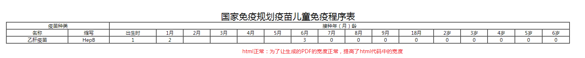
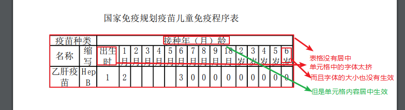
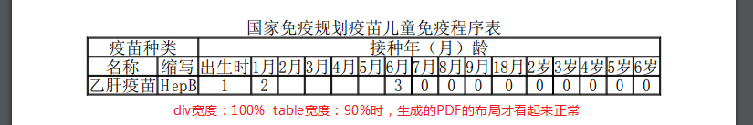
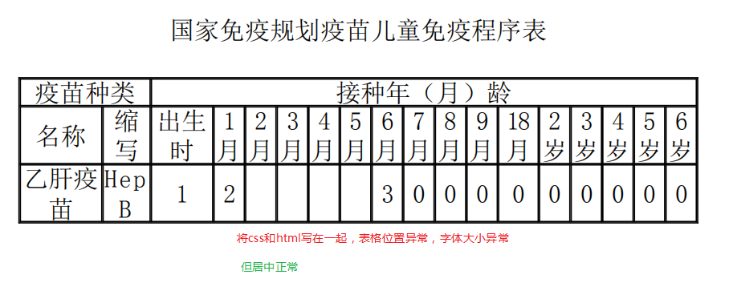
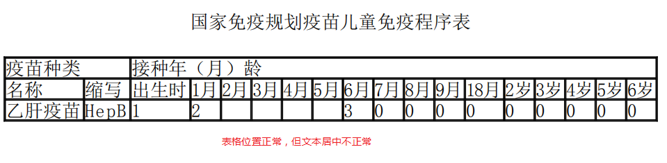
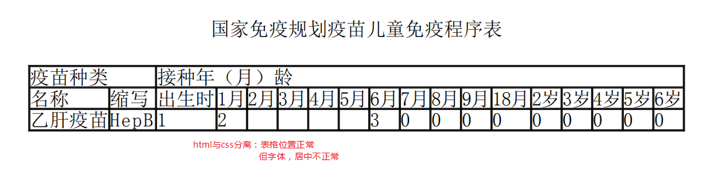

# itext:

<https://blog.csdn.net/u010142437/article/details/84032005> 

## 环境搭建：

导入mavenjar包：

```xml
<!--itext -->
<dependency>
            <groupId>com.itextpdf</groupId>
            <artifactId>itextpdf</artifactId>
            <version>5.5.0</version>
 </dependency>
<!--itext中文支持包 -->
<dependency>
            <groupId>com.itextpdf</groupId>
            <artifactId>itext-asian</artifactId>
            <version>5.2.0</version>
</dependency>
<!--解析html，生成PDF(不根据Html生成可不导) -->
<dependency>         
            <groupId>com.itextpdf.tool</groupId>              
            <artifactId>xmlworker</artifactId>            
            <version>5.5.8</version>
            <exclusions>
                <exclusion>
                    <groupId>com.itextpdf</groupId>
                    <artifactId>itextpdf</artifactId>
                </exclusion>
            </exclusions>    
</dependency>
```

## demo

```properties
@Test
    public void testCreateSimplePdf1() {
        // 要生成的文档，可通过它来操作内容
        Document document = new Document();
        PdfWriter pdfWriter = null;
        try {
            // 对document的操作，都会写入流中
            pdfWriter = PdfWriter.getInstance(document, new FileOutputStream("D:/test.pdf"));
            document.open();
            document.add(new Paragraph("hello world"));
        } catch (DocumentException | FileNotFoundException e) {
            e.printStackTrace();
        } finally {
            document.close();
            assert pdfWriter != null;
            pdfWriter.close();
        }
    }
```

### 字体设置

```java
Font font = new Font(baseFont);
// 可选配置：
    // 设置字体大小
    font.setSize(13);
    // 设置字体颜色
    font.setColor(new BaseColor(255, 0, 0));
    // 设置类型，为正常
    font.setStyle(Font.NORMAL);
    // 设置类型，加粗
    font.setStyle(Font.BOLD);
    // 设置类型，倾斜
    font.setStyle(Font.ITALIC);
    // 设置类型，下划线
    font.setStyle(Font.UNDERLINE);
    // 设置类型，可组合，倾斜+删除线
    font.setStyle(Font.ITALIC | Font.STRIKETHRU);
```

`tipes:`

#### 支持中文的三种方式：

==中文字体：==

1.使用Windows系统字体(TrueType)

```
BaseFont baseFont = BaseFont.createFont("C:/Windows/Fonts/SIMYOU.TTF", BaseFont.IDENTITY_H,
					BaseFont.NOT_EMBEDDED);
```

2.使用自己的资源字体 (需要放在classpath下)

```
BaseFont baseFont = BaseFont.createFont("/SIMYOU.TTF", BaseFont.IDENTITY_H, BaseFont.NOT_EMBEDDED);

```

3.使用iTextAsian.jar中的字体 （==有效==）

```
BaseFont baseFont = BaseFont.createFont("STSong-Light", "UniGB-UCS2-H", BaseFont.NOT_EMBEDDED);
```

**通过上述基本字体，构造itext的Font类：**

demo:

```java
@Test
public void testCreateSimplePdf2() {
	Document document = new Document();
    PdfWriter pdfWriter = null;
	try {
      pdfWriter = PdfWriter.getInstance(document, new FileOutputStream("D:/中文支持.pdf"));
	  // 中文字体支持
      BaseFont baseFont = BaseFont.createFont
          ("STSong-Light", "UniGB-UCS2-H", BaseFont.NOT_EMBEDDED);
      Font font = new Font(baseFont);
            // 文档基本属性
            document.open();
            document.addAuthor("wx");// 作者
            document.addTitle("PDF生成测试"); // 标题
            document.addSubject("this is subject"); //主题
            document.addKeywords("Keywords"); //关键字
            document.addCreationDate();//创建时间
            document.addCreator("LOL");// 创建程序
            // 创建一个段落
            Paragraph paragraph = new Paragraph("让iText生成的PDF支持中文字体",font);// 段落
		   //  将段落加入文档中
            document.add(paragraph);
        } catch (DocumentException | IOException e) {
            e.printStackTrace();
        } finally {
            // 释放资源
            document.close();
            assert pdfWriter != null;
            pdfWriter.close();
        }
    }
```

通过继承接口：

```java
XMLWorkerHelper.getInstance().parseXHtml(pdfWriter, 
	document, html, css,  Charset.forName("UTF-8"),new ChineseFontProvider());

```


```java
public static final class ChinaFontProvide implements FontProvider {
 
		@Override
		public Font getFont(String arg0, String arg1, boolean arg2, float arg3, int arg4, BaseColor arg5) {
			BaseFont bfChinese = null;
			try {
				bfChinese = BaseFont.createFont("STSong-Light", "UniGB-UCS2-H", BaseFont.NOT_EMBEDDED);
				//也可以使用Windows系统字体(TrueType)
		        //bfChinese = BaseFont.createFont("C:/WINDOWS/Fonts/SIMYOU.TTF", BaseFont.IDENTITY_H,BaseFont.NOT_EMBEDDED); 
			} catch (Exception e) {
				e.printStackTrace();
			}
			Font FontChinese = new Font(bfChinese, 20, Font.NORMAL);
			return FontChinese;
		}
 
		@Override
		public boolean isRegistered(String arg0) {
			return false;
		}
	}
```

或匿名类：

```java
XMLWorkerHelper.getInstance().parseXHtml
	(writer, document, htmlStream , (InputStream) null, new XMLWorkerFontProvider() {
       @Override
       public Font getFont(final String fontname, final String encoding, 
           		final boolean embedded, final float size,
           		final int style, final BaseColor color) {
           BaseFont bf = null;
           try {
              bf = BaseFont.createFont("STSong-Light", 
              		"UniGB-UCS2-H", BaseFont.NOT_EMBEDDED);
           } catch (Exception e) {
              e.printStackTrace();
           }
              Font font = new Font(bf, size, style, color);
              font.setColor(color);
              return font;
           }
});
```

## 通过itextAPI生成PDF

### 添加表格

```java
 /**
     * 表格各种属性综合使用
     *
     * @throws IOException
     * @throws DocumentException
     */
    @Test
    public  void createTablePdf() throws IOException, DocumentException {
        Document document = new Document();
        // 创建PdfWriter对象
        PdfWriter writer = PdfWriter.getInstance(document, new FileOutputStream("D:/complexTable22.pdf"));
        // 打开文档
        document.open();

        // 添加表格，4列
        PdfPTable table = new PdfPTable(4);
        //// 设置表格宽度比例为%100
        table.setWidthPercentage(100);
        // 设置表格的宽度
        table.setTotalWidth(500);
        // 也可以每列分别设置宽度
//         table.setTotalWidth(new float[]{160, 70, 130, 100,200}); // 和列数对应
        // 锁住宽度
        table.setLockedWidth(true);
        // 设置表格上面空白宽度
        table.setSpacingBefore(10f);
        // 设置表格下面空白宽度
        table.setSpacingAfter(10f);
        // 设置表格默认为无边框
        table.getDefaultCell().setBorder(0);
        PdfContentByte cb = writer.getDirectContent();

        // 构建每个单元格
        PdfPCell cell1 = new PdfPCell(new Paragraph("Cell 1"));
        // 边框颜色
        cell1.setBorderColor(BaseColor.BLUE);
        // 设置背景颜色
        cell1.setBackgroundColor(BaseColor.ORANGE);
        // 设置跨两行
        cell1.setRowspan(2);
        // 设置距左边距
        cell1.setPaddingLeft(10);
        // 设置高度
        cell1.setFixedHeight(20);
        // 设置内容水平居中显示
        cell1.setHorizontalAlignment(Element.ALIGN_CENTER);
        // 设置垂直居中
        cell1.setVerticalAlignment(Element.ALIGN_MIDDLE);
        // 将单元格放入表格
        table.addCell(cell1);

        PdfPCell cell2 = new PdfPCell(new Paragraph("Cell 2"));
        cell2.setBorderColor(BaseColor.GREEN);
        cell2.setPaddingLeft(10);
        cell2.setHorizontalAlignment(Element.ALIGN_CENTER);
        cell2.setVerticalAlignment(Element.ALIGN_MIDDLE);
        table.addCell(cell2);

        PdfPCell cell3 = new PdfPCell(new Paragraph("Cell 3"));
        cell3.setBorderColor(BaseColor.RED);
        cell3.setPaddingLeft(10);
        // 设置无边框
        cell3.setBorder(Rectangle.NO_BORDER);
        cell3.setHorizontalAlignment(Element.ALIGN_CENTER);
        cell3.setVerticalAlignment(Element.ALIGN_MIDDLE);
        table.addCell(cell3);

        // 在表格添加图片
        Image cellimg = Image.getInstance("C:\\ample Pictures\\Git常用命令.jpg");
        PdfPCell cell4 = new PdfPCell(cellimg, true);
        cell4.setBorderColor(BaseColor.RED);
        cell4.setPaddingLeft(10);
        cell4.setFixedHeight(30);
        cell4.setHorizontalAlignment(Element.ALIGN_CENTER);
        cell4.setVerticalAlignment(Element.ALIGN_MIDDLE);
        table.addCell(cell4);

        // 增加一个条形码到表格
        Barcode128 code128 = new Barcode128();
        code128.setCode("14785236987541");
        code128.setCodeType(Barcode128.CODE128);
        // 生成条形码图片
        Image code128Image = code128.createImageWithBarcode(cb, null, null);
        // 加入到表格
        PdfPCell cellcode = new PdfPCell(code128Image, true);
        cellcode.setHorizontalAlignment(Element.ALIGN_CENTER);
        cellcode.setVerticalAlignment(Element.ALIGN_MIDDLE);
        cellcode.setFixedHeight(30);
        table.addCell(cellcode);

        PdfPCell cell5 = new PdfPCell(new Paragraph("Cell 5"));
        cell5.setPaddingLeft(10);
        // 设置占用列数
        cell5.setColspan(2);
        cell5.setHorizontalAlignment(Element.ALIGN_CENTER);
        cell5.setVerticalAlignment(Element.ALIGN_MIDDLE);
        table.addCell(cell5);
        document.add(table);
        // 关闭文档
        document.close();

    }
```

`Tips:`

​	单元格文本居中问题：

```java
一般情况：
	水平居中： cell.setHorizontalAlignment(Element.ALIGN_CENTER);
	垂直居中： cell.setVerticalAlignment(Element.ALIGN_MIDDLE);
但有时不生效：
	垂直不生效：
		先调用cell.setUseAscender(true); //设置可以居中
		再调用cell.setVerticalAlignment(Element.ALIGN_MIDDLE);// 设置垂直居中
	水平不生效：
		单独设置该单元格的文本居中：
		PdfPCell cell1OfFirstRow = new PdfPCell();
		cell1OfFirstRow.setColspan(2);
		Paragraph p = new Paragraph("疫苗种类", font);
		p.setAlignment(Element.ALIGN_CENTER);//直接设置内容：可解决水平居中，但无法解决垂直居中
		cell1OfFirstRow.addElement(p);

	
```


### 添加图片

```java
// 1.创建itext中的图片类
Image image = Image.getInstance("C:/image/test.jpg"); // 图片的路径
// 2.可设置图片的属性
// 设置图片位置: 以pdf页面为基准，x轴和y轴从页面左下角开始为0点定位。
image.setAbsolutePosition(100f, 550f);
// 设置图片的宽度和高度
image.scaleAbsolute(400, 200);
// 3.将图片加入文档中
document.add(image1);
```

***

## 直接编写html代码生成PDF：

步骤：

​	1.首先，直接根据数据和样式要求，编写html代码

​	2.然后，通过    `XMLWorkerHelper.getInstance().parseXHtml(...);`将html解析成PDF

代码：

html:

```html
<!DOCTYPE html>
<html lang="en">
<head>
    <meta charset="UTF-8"/>
    <title>Title</title>
    <style type="text/css">
        div{
            margin:0 auto;
            width:100%;
            height:80%;
        }
        caption{
            vertical-align: middle;
            text-align: center;
            font-size: 22px;
        }
        td{
            vertical-align: middle;
            text-align: center;
            font-size: 12px;
        }
    </style>
</head>
<body>
    <div>
        <table width="70%" border="1px" cellpadding="0" cellspacing="0" align="center">
            <caption>国家免疫规划疫苗儿童免疫程序表</caption>
            <br/>
            <tr>
                <td colspan="2">
                    疫苗种类
                </td>
                <td colspan="16">
                    接种年（月）龄
                </td>
            </tr>
            <tr>
                <td>名称</td>
                <td>缩写</td>
                <td>出生时</td>
                <td>1月</td>
                <td>2月</td>
                <td>3月</td>
                <td>4月</td>
                <td>5月</td>
                <td>6月</td>
                <td>7月</td>
                <td>8月</td>
                <td>9月</td>
                <td>18月</td>
                <td>2岁</td>
                <td>3岁</td>
                <td>4岁</td>
                <td>5岁</td>
                <td>6岁</td>
            </tr>
            <tr>
                <td>乙肝疫苗</td>
                <td>HepB</td>
                <td>1</td>
                <td>2</td>
                <td></td>
                <td></td>
                <td></td>
                <td></td>
                <td>3</td>
                <td>0</td>
                <td>0</td>
                <td>0</td>
                <td>0</td>
                <td>0</td>
                <td>0</td>
                <td>0</td>
                <td>0</td>
                <td>0</td>
            </tr>
        </table>
    </div>
</body>
</html>
```

java:

```java
@Test
public void createChildByHtml() {
   Document document = new Document();
   try {
      InputStream resourceAsStream = this.getClass().getClassLoader()
      	.getResourceAsStream("templates/child.html");
      PdfWriter pdfWriter = PdfWriter
      	.getInstance(document, new FileOutputStream("D:/PDF3.pdf"));
      document.open();
      // 这种方式也行，将字符串转成字节流
//    String html = testGetHtmlStr();
//    ByteArrayInputStream b = new ByteArrayInputStream(html.getBytes());
      XMLWorkerHelper.getInstance().parseXHtml(pdfWriter, document, resourceAsStream, 
      	(InputStream) null, new ChinaFontProvide());
   } catch (DocumentException | IOException e) {
      e.printStackTrace();
   } finally {
      document.close();
   }
}
```


**问题：**

**html：**



**生成的PDF：**（90%   70%）

	

调整宽度后的PDF：（100% 90%）

​	

html和css在一起：



```
XMLWorkerHelper.getInstance().parseXHtml(pdfWriter, document, b,null, 
	Charset.forName("UTF-8"),new ChineseFontProvider());
```

html和css分离：

```html
<head>
    <meta charset="UTF-8"/>
    <title>Title</title>
    <link rel="stylesheet" href="child.css"/>
</head>
```


```java
Document document = new Document();
try {
	InputStream html = this.getClass().getClassLoader()
        .getResourceAsStream("templates/child.html");
    // 加载css文件：当参数传入时，字体和布局都异常
	//InputStream css = this.getClass().getClassLoader()
    	//.getResourceAsStream("templates/child.css");
    PdfWriter pdfWriter = PdfWriter.getInstance
        (document, new FileOutputStream("D:/直接编写html来生成PDF7.pdf"));
    document.open();
 	XMLWorkerHelper.getInstance()
        .parseXHtml(pdfWriter, document, html, 
                    (InputStream) null, new ChineseFontProvider());
} catch (DocumentException | IOException e) {
    e.printStackTrace();
} finally {
    document.close();
}
```



`Tips:`

​	html标签一定要==全闭和==，否则报 the document has no pages




样式问题

​	不够灵活，一个PDF文档就需要编写一个html页面

​	对html+css有一定要求

***

## 通过freemarker+itext生成PDF

主要思路是，使用  `com.itextpdf.tool.XmlWorker包`下的Api

可配合网页静态化技术一起使用：freemarker+itext


```java
// 通过自定义函数，获取生成静态化页面的字符串
String html = translateFtlToHtml("test.ftl", modelMap);

XMLWorkerHelper.getInstance().parseXHtml(writer, document, new StringReader(html));
```

生成静态化页面，并返回其字符串

```java
 
```


### html:

```html
<!DOCTYPE html>
<html lang="en">
<head>
    <meta charset="UTF-8"/>
    <title>Title</title>
    <style type="text/css">
        div {
            margin: 0 auto;
            width: 80%;
            height: 80%;
        }
        td {
            vertical-align: middle;
            text-align: center;
            font-size: 12px;
            border: 1px solid black;
        }
    </style>
</head>
<body>
    <div>
        <div style="vertical-align: middle;text-align:center;font-size:22px ">
            国家免疫规划疫苗儿童免疫程序表
        </div>
        <br/>
        <table width="70%" cellpadding="0"  cellspacing="0"  align="center" style="border: 1px solid black">
            <tr>
                <td colspan="2">
                    疫苗种类
                </td>
                <td colspan="15">
                    接种年(月)龄
                </td>
            </tr>
            <tr>
                <td>名称</td>
                <td>缩写</td>
                <td>出生时</td>
                <td>1月</td>
                <td>2月</td>
                <td>3月</td>
                <td>4月</td>
                <td>5月</td>
                <td>6月</td>
                <td>8月</td>
                <td>9月</td>
                <td>18月</td>
                <td>2岁</td>
                <td>3岁</td>
                <td>4岁</td>
                <td>5岁</td>
                <td>6岁</td>
            </tr>
            <#list myList as item>
                <tr>
                    <td>${item.vaccineName}</td>
                    <td>${item.abbreviation}</td>

                    <#list item.vaccinationTime as subItem>
                            <td>
                               ${subItem ! ""}
                            </td>
                    </#list>
                </tr>
            </#list>
        </table>
    </div>
</body>
</html>
```

### java

将html页面转换成ftl模板：

```java
public String translateFtlToHtml(String ftlFileName, Object model) {
        StringWriter writer = null;
        try {
            Configuration configuration = new Configuration(Configuration.getVersion());
            // 模板所在的目录
            configuration.setDirectoryForTemplateLoading(new File("resources/templates"));
            // 模板的字符编码
            configuration.setDefaultEncoding("utf-8");
            // 根据模板名获取指定模板
            Template template = configuration.getTemplate(ftlFileName);
            // 
            writer = new StringWriter();
            // 填充数据
            template.process(model, writer);
            writer.flush();
            return writer.toString();
        } catch (IOException | TemplateException e) {
            e.printStackTrace();
        } finally {
            try {
                assert writer != null;
                writer.close();
            } catch (IOException e) {
                e.printStackTrace();
            }
        }
        return "";
    }
```

根据填充好的模板生成PDF

```java
 /**
     * 直接生成pdf文件，而不是返回流
     */
    @Test
    public void testCreatePdfByTranslateHtmlToFtl1(){
        Map<String,List<VaccineImmunizationInChildData>> rootDateModel = new HashMap<>();
        List<VaccineImmunizationInChildData> vaccineImmunizationInChildDataList = new ArrayList<>();

        VaccineImmunizationInChildData v1 = new VaccineImmunizationInChildData();
        v1.setVaccineName("乙肝疫苗");
        v1.setAbbreviation("HepB");
        String[] time = new String[15];
        time[0] = "1";
        time[5] = "3";
        time[9] = "2";
        time[14] = "16";

        v1.setVaccinationTime(time);
        vaccineImmunizationInChildDataList.add(v1);

        v1 = new VaccineImmunizationInChildData();
        v1.setVaccineName("卡介苗");
        v1.setAbbreviation("BCG");
        String[] time2 = new String[15];
        time2[0] = "1";
        time2[7] = "2";
        v1.setVaccinationTime(time2);
        vaccineImmunizationInChildDataList.add(v1);

        v1 = new VaccineImmunizationInChildData();
        v1.setVaccineName("脊灰灭活疫苗");
        v1.setAbbreviation("IPV");
        String[] time3 = new String[15];
        time3[2] = "1";
        time3[5] = "2";
        time3[14] = "16";
        v1.setVaccinationTime(time3);
        vaccineImmunizationInChildDataList.add(v1);

        rootDateModel.put("myList", vaccineImmunizationInChildDataList);
        // 获取抓换后的ftl字符串
        String ftlStr = translateFtlToHtml("child3.ftl", rootDateModel);

        try {
            // 直接生成PDF文件
            Html2PdfUtils.createPdf(ftlStr,"D:/直接生成pdf文件.pdf");
        } catch (IOException | DocumentException e) {
            e.printStackTrace();
        }
    }

```


```java
 /**
     * 返回流，而不是生成文件
     */
    @Test
    public void testCreatePdfByTranslateHtmlToFtl2(){
        ByteArrayInputStream byteStreamOfPdf = null;
        FileOutputStream outputStream = null;
        try {
            Map<String,List<VaccineImmunizationInChildData>> rootDateModel = new HashMap<>();
            List<VaccineImmunizationInChildData> vaccineImmunizationInChildDataList = new ArrayList<>();


            VaccineImmunizationInChildData v1 = new VaccineImmunizationInChildData();
            v1.setVaccineName("乙肝疫苗");
            v1.setAbbreviation("HepB");
            String[] time = new String[15];
            time[0] = "1";
            time[5] = "3";
            time[9] = "2";
            time[14] = "16";
            v1.setVaccinationTime(time);
            vaccineImmunizationInChildDataList.add(v1);

            v1 = new VaccineImmunizationInChildData();
            v1.setVaccineName("卡介苗");
            v1.setAbbreviation("BCG");
            String[] time2 = new String[15];
            time2[0] = "1";
            time2[7] = "2";
            v1.setVaccinationTime(time2);
            vaccineImmunizationInChildDataList.add(v1);

            v1 = new VaccineImmunizationInChildData();
            v1.setVaccineName("脊灰灭活疫苗");
            v1.setAbbreviation("IPV");
            String[] time3 = new String[15];
            time3[2] = "1";
            time3[5] = "2";
            time3[14] = "16";
            v1.setVaccinationTime(time3);
            vaccineImmunizationInChildDataList.add(v1);

            rootDateModel.put("myList", vaccineImmunizationInChildDataList);

            // 获取抓换后的ftl字符串
            String ftlStr = translateFtlToHtml("child3.ftl", rootDateModel);
            // PDF字节流的字符串形式
            String result = Html2PdfUtils.createPdf(ftlStr);
            // 将PDF字符串转码后，生成输入字节输入流
            byteStreamOfPdf = new ByteArrayInputStream(result.getBytes(StandardCharsets.ISO_8859_1));

            // 输入目的地
            outputStream = new FileOutputStream(new File("D:/生成流.pdf"));
            // 读取字节输入流，将数据写入到文件输出流中，生成PDF文件
            byte[] b = new byte[2048];
            int len;
            while ((len = byteStreamOfPdf.read(b)) !=-1){
                outputStream.write(b, 0, len);
            }
        } catch (IOException | DocumentException e) {
            e.printStackTrace();
        } finally {
            try {
                assert outputStream != null;
                outputStream.close();
                byteStreamOfPdf.close();
            } catch (IOException e) {
                e.printStackTrace();
            }

        }
    }
```

PDF工具类：

```java
package com.wxss.freemarkerlearn;

import com.itextpdf.html2pdf.ConverterProperties;
import com.itextpdf.html2pdf.HtmlConverter;
import com.itextpdf.html2pdf.attach.impl.layout.HtmlPageBreak;
import com.itextpdf.kernel.geom.PageSize;
import com.itextpdf.kernel.pdf.PdfDocument;
import com.itextpdf.kernel.pdf.PdfWriter;
import com.itextpdf.layout.Document;
import com.itextpdf.layout.element.IBlockElement;
import com.itextpdf.layout.element.IElement;
import com.itextpdf.layout.font.FontProvider;
import com.itextpdf.text.DocumentException;
import com.itextpdf.text.pdf.BaseFont;

import java.io.ByteArrayOutputStream;
import java.io.IOException;
import java.io.OutputStream;
import java.nio.charset.StandardCharsets;
import java.util.List;

/**
 * by 明明如月 github :https://github.com/chujianyun
 * 表格边框不显示
 */

public class Html2PdfUtils {

    /**
     * 字体所在目录
     */
    private static final String FONT_RESOURCE_DIR = "/font";

    /**
     * @param htmlContent html文本
     * @param dest        目的文件路径，如 /xxx/xxx.pdf
     * @throws IOException IO异常
     */
    public static void createPdf(String htmlContent, String dest) throws IOException, DocumentException {
        ConverterProperties props = new ConverterProperties();
        // props.setCharset("UFT-8"); 编码
        FontProvider fp = new FontProvider();
        fp.addStandardPdfFonts();
        fp.addSystemFonts();
        props.setFontProvider(fp);
        // 也可以使用本地字体文件：.ttf 字体所在目录
//        String resources = Html2PdfUtils.class.getResource(FONT_RESOURCE_DIR).getPath();
//        fp.addDirectory(resources);
        // html中使用的图片等资源目录（图片也可以直接用url或者base64格式而不放到资源里）
        // props.setBaseUri(resources);

        List<IElement> elements = HtmlConverter.convertToElements(htmlContent, props);
        PdfDocument pdf = new PdfDocument(new PdfWriter(dest));
        Document document = new Document(pdf, PageSize.A4.rotate(), false);
        for (IElement element : elements) {
            // 分页符
            if (element instanceof HtmlPageBreak) {
                document.add((HtmlPageBreak) element);

                //普通块级元素
            } else {
                document.add((IBlockElement) element);
            }
        }
        document.close();
    }

    /**
     * 返回字节输出流
     *
     * @param htmlContent
     * @return
     * @throws IOException
     * @throws DocumentException
     */
    public static String createPdf(String htmlContent) throws IOException, DocumentException {
        ByteArrayOutputStream baos = new ByteArrayOutputStream();

        ConverterProperties props = new ConverterProperties();
        // props.setCharset("UFT-8"); 编码
        FontProvider fp = new FontProvider();
        fp.addStandardPdfFonts();
        fp.addSystemFonts();
        props.setFontProvider(fp);
        // 也可以使用本地字体文件：.ttf 字体所在目录
//        String resources = Html2PdfUtils.class.getResource(FONT_RESOURCE_DIR).getPath();
//        fp.addDirectory(resources);
        // html中使用的图片等资源目录（图片也可以直接用url或者base64格式而不放到资源里）
        // props.setBaseUri(resources);

        List<IElement> elements = HtmlConverter.convertToElements(htmlContent, props);
        PdfDocument pdf = new PdfDocument(new PdfWriter(baos));
        Document document = new Document(pdf, PageSize.A4.rotate(), false);
        for (IElement element : elements) {
            // 分页符
            if (element instanceof HtmlPageBreak) {
                document.add((HtmlPageBreak) element);

                //普通块级元素
            } else {
                document.add((IBlockElement) element);
            }
        }
        document.close();
        return new String(baos.toByteArray(), StandardCharsets.ISO_8859_1);
    }


}
```

`Tips：`

​	html标签必须全部关闭，否则Invalid nested tag br found, expected closing tag li 


qq邮箱

```
package com.mdiaf.util;

import java.io.File;
import java.io.UnsupportedEncodingException;
import java.util.Properties;

import javax.activation.DataHandler;
import javax.activation.DataSource;
import javax.activation.FileDataSource;
import javax.mail.Message;
import javax.mail.MessagingException;
import javax.mail.Multipart;
import javax.mail.Session;
import javax.mail.Transport;
import javax.mail.internet.InternetAddress;
import javax.mail.internet.MimeBodyPart;
import javax.mail.internet.MimeMessage;
import javax.mail.internet.MimeMultipart;
import javax.mail.internet.MimeUtility;

import org.apache.commons.lang.StringUtils;

/**
 * 通用邮件工具类
 * @author D2
 */
public class MailUtil {
	/**
	 * @param mailTitle 邮件标题
	 * @param mailContent 邮件正文（含附件）
	 * @param mailContentWithoutAttachment 邮件正文（无附件）
	 * @param mailTo 邮件接收人（多个地址使用西文逗号分隔）
	 * @param mailCc 邮件抄送人（多个地址使用西文逗号分隔）
	 * @param fileAsAttachment 邮件附件
	 */
	public static void sendMail(String mailTitle, String mailContent, String mailContentWithoutAttachment, String mailTo, String mailCc, File fileAsAttachment) {	
		try {
			Properties properties = System.getProperties();
			//设置smtp服务器
			properties.setProperty("mail.smtp.host", "smtp.exmail.qq.com");
			properties.put("mail.smtp.auth", "true");
			properties.setProperty("mail.transport.protocol", "smtp");
			Session session = Session.getInstance(properties);
			session.setDebug(true);

			MimeMessage message = new MimeMessage(session);
			InternetAddress sender = new InternetAddress("noreply@fc18.com.cn");
			message.setFrom(sender);
			
			if (!StringUtils.isBlank(mailTo)) {
				//接收人
				String[] mailToList = mailTo.split(",");
				for (String mailToPerson : mailToList)
					message.addRecipient(Message.RecipientType.TO, new InternetAddress(mailToPerson));

				//抄送人
				if (StringUtils.isNotBlank(mailCc)){
					for (String mailCcPerson : mailCc.split(","))
						message.addRecipient(Message.RecipientType.CC, new InternetAddress(mailCcPerson));
				}
				message.setSubject(StringUtils.isNotBlank(mailTitle) ? mailTitle : "");
				
				//附件
				if (fileAsAttachment != null) {
					String content = StringUtils.isNotBlank(mailContent) ? mailContent : "";
					message.setContent(content, "text/html;charset=utf-8");
					String fileName = fileAsAttachment.getName();
					MimeBodyPart mimeBodyPart = new MimeBodyPart();
					mimeBodyPart.setText(content);
					Multipart multipart = new MimeMultipart();
					multipart.addBodyPart(mimeBodyPart);
					mimeBodyPart = new MimeBodyPart();
					DataSource dataSource = new FileDataSource(fileAsAttachment);
					mimeBodyPart.setDataHandler(new DataHandler(dataSource));
					mimeBodyPart.setFileName(MimeUtility.encodeWord(fileName));
					multipart.addBodyPart(mimeBodyPart);
					message.setContent(multipart);
					message.saveChanges();
					Transport transport = session.getTransport();
					transport.connect("smtp.exmail.qq.com", "noreply@fc18.com.cn", "Fcjr@8888");
					transport.sendMessage(message, message.getAllRecipients());
					transport.close();	
				}
				//无附件
				else {
					String content = StringUtils.isNotBlank(mailContentWithoutAttachment) ? mailContentWithoutAttachment : "";
					message.setContent(content, "text/html;charset=utf-8");
					MimeBodyPart mimeBodyPart = new MimeBodyPart();
					mimeBodyPart.setText(content);
					Multipart multipart = new MimeMultipart();
					multipart.addBodyPart(mimeBodyPart);
					message.setContent(multipart);
					message.saveChanges();
					Transport transport = session.getTransport();
					transport.connect("smtp.exmail.qq.com", "noreply@fc18.com.cn", "Fcjr@8888");
					transport.sendMessage(message, message.getAllRecipients());
					transport.close();
				}
			}
			
		}
		catch (MessagingException e) {
			e.printStackTrace();
		}
		catch (UnsupportedEncodingException e) {
			e.printStackTrace();
		}
	}
	
}

```


ctrl+c 停止ping


ctrl  s  锁死屏幕

ctrl  q 解锁屏幕


/etc/locale.conf : 修改的是localectl

etc/profile 和  /etc/sysconfig/i18n :修改的是locale 和 LANG


1、系统必须安装中文语言包才行
\# yum -y groupinstall chinese-support

2、仅仅有语言包还不行，我们得设置相应的字符集


临时生效  # export LANG="zh_CN.UTF-8"    # 设置为中文  # export LANG="en_US.UTF-8"    # 设置为英文，我比较喜欢这样 export LANG=C  

 永久生效， 编辑/etc/sysconfig/i18n（最好reboot一下）  LANG="zh_CN.UTF-8" 

或者，编辑 /etc/profile配置文件，添加如下一行  export LANG="zh_CN.UTF-8" # 重新载入  # . /etc/profile     

\## 查看当前的字符集 
\# echo $LANG

好了，经过上面的