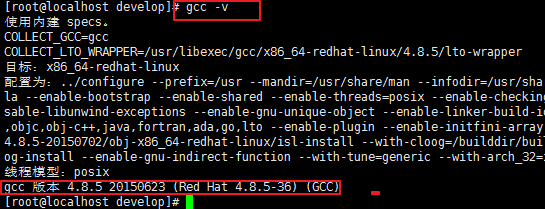
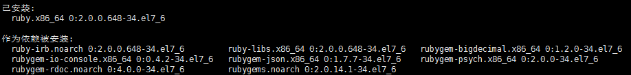

#linux 环境redis使用：

##安装

安装目录： `/usr/local/src/redis`

```
1.上传压缩包：redis-3.0.6.tar.gz
2.解压压缩包：tar zxvf redis-3.0.6.tar.gz
3.进入解压后的目录,执行make命令进行编译:
	cd /usr/local/src/redis/redis-3.0.6
    make
4.进入src目录，执行：
	make install
5.出现下列内容，证明安装成功：
	Hint:It`s a good idea to run 'make test';
		INSTALL install
		INSTALL install
		INSTALL install
		INSTALL install
		INSTALL install

```

`tips:`

​	**1.安装时，需要gcc环境，否则make报错**

​		1.查看是否已安装gcc：	`gcc -v`

​			··

​		2.没有安装的话，可使用下列命令安装：		

​			`yum install gcc`或  `yum install gcc-c++`

​	**2.上述步骤3,4可以替换为：**

​		` make && make install  `

​	**make 这里如果不指定  `PREFIX`，默认将安装在  `/usr/local/bin下`，根据需要选择**


>为了方便，可以创建两个目录：
>
>​	配置文件目录: etc
>
>​	命令目录	      ：bin
>
>然后将redis.conf文件移动到etc目录下，将src目录下的 XXX.sh命令移动到bin目录下

##redis配置文件	

​	redis中主要有两个配置文件:

​	`redis.conf:` 

​	`redis-sentinel.conf`


redis服务：

​	默认情况下，redis前台启动的，只要当前会话关闭，服务也会关闭

​	需要修改为后台启动：修改redis.cong配置文件：

​	


##Redis集群

>redis集群采用P2P模式，是完全去中心化的，不存在中心节点或者代理节点；
>redis集群是没有统一的入口的，客户端（client）连接集群的时候连接集群中的任意节点（node）>即可，集群内部的节点是相互通信的（PING-PONG机制），每个节点都是一个redis实例；
>为了实现集群的高可用，即判断节点是否健康（能否正常使用），redis-cluster有这么一个投票容>错机制：如果集群中超过半数的节点投票认为某个节点挂了，那么这个节点就挂了（fail）。这是>判断节点是否挂了的方法；

环境配置：

需要ruby：

安装ruby:

`yum install ruby`



`yum install rubygems`


