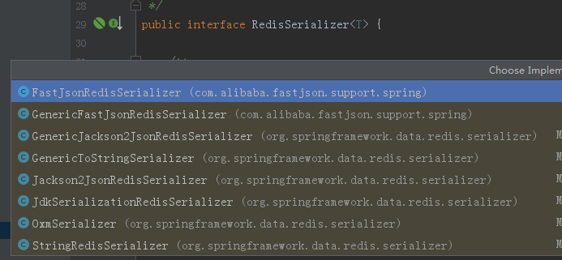

#Redis序列化与反序列化:

##序列化与反序列化

###序列化：

###反序列化：

***

`RedisTemplate`默认采用的是JDK提供的序列化方式：

`org.springframework.data.redis.serializer.JdkSerializationRedisSerializer`

`StringTemplate`（**是RedisTemplate的子类，专门用来处理String类型的数据**）默认采用:

`org.springframework.data.redis.serializer.StringRedisSerializer`

上述两种序列化方式，都实现了RedisSerializer<T>接口，该接口实现类还有：



**对比：**

> JdkSerializationRedisSerializer: 
>
> 使用JDK提供的序列化功能。 优点是反序列化时不需要提供类型信息(class)，
>
> 但缺点是需要实现Serializable接口，还有序列化后的结果非常庞大，是JSON格式的5倍左右，这样就会消耗redis服务器的大量内存。
>
> Jackson2JsonRedisSerializer：
>
>  使用Jackson库将对象序列化为JSON字符串。优点是速度快，序> 列化后的字符串短小精悍，不需要实现Serializable接口。
>
> 但缺点也非常致命，那就是此类的构造函数中有一个类型参数，必须提供要序列化对象的类型信息(.class对象)。 通过查看源代码，发现其只在反序列化过程中用到了类型信息。

**spring-mvc.xml:**

```xml
<!--开启mvc注解支持：必须放在下面配置的前面，否则，下面的配置无法生效-->
<mvc:annotation-driven />
<!--配置fastjson-->
<mvc:annotation-driven>
        <mvc:message-converters register-defaults="true">
            <bean class="com.alibaba.fastjson.support.spring.FastJsonHttpMessageConverter">
                <property name="supportedMediaTypes" value="application/json"/>
                <property name="features">
                    <array>
                        <value>WriteMapNullValue</value>
                        <value>WriteDateUseDateFormat</value>
                    </array>
                </property>
            </bean>
        </mvc:message-converters>
</mvc:annotation-driven>
```

也可在Redis的配置文件中，设置序列化：

```XML
<bean id="redisTemplate" class="org.springframework.data.redis.core.RedisTemplate">
	<property name="connectionFactory" ref="connectionFactory"/>
	<property name="keySerializer">
            <bean class="org.springframework.data.redis.serializer.StringRedisSerializer"/>
    </property>
    <property name="hashKeySerializer">
            <bean class="org.springframework.data.redis.serializer.StringRedisSerializer"/>
    </property>
    <property name="valueSerializer">
            <bean 
          class="org.springframework.data.redis.serializer.JdkSerializationRedisSerializer"/>
    </property>
    <property name="hashValueSerializer">
            <bean                      				                            	                 class="org.springframework.data.redis.serializer.JdkSerializationRedisSerializer"/>
    </property>
</bean>
```

