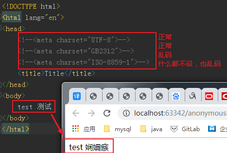

# 中文乱码

[TOC]

***

## 字符编码和字符集：

<https://blog.csdn.net/qq_42068856/article/details/83792174> 

***

## linux中文乱码：

***

## maven控制台中文乱码：

​	`Setting->maven->runner  VMoptions:-Dfile.encoding=GB2312  `

***

##web中文乱码：

​	参考：<https://blog.csdn.net/menghuanzhiming/article/details/79261034> 

​	**大致可分为 `源文件乱码`和 `请求/响应乱码`**

`源文件乱码`：如jsp和html编码设置错误或没有设置




```jsp
<!-- contentType设置错误，页面中文乱码-->
<%@ page contentType="text/html;charset=UTF-8" language="java" %>
```

`请求/响应乱码`：

​	主要是      `GET` 和 `PUT` **请求/响应**中文乱码

***

### url：

1. 避免url中出现中文参数：可以创建一个表与中文关联，然后传递中文对应的英文或者数字

2. 对url进行编码和解码：在前后台进行url的编码和解码

   ```js
   // JS
   编码:
   	encodeURI(str)或encodeURIComponent(str);
   解码:
   	decodeURI(str)或decodeURIComponent(str);
   // 后台
   编码
   	HttpContext.Current.Server.UrlEncode(str); 
   解码
   	HttpContext.Current.Server.UrlDecode(str);
   ```

`拓展：`

​	编码：

​	url编码：

​	只有 0-9[a-Z] $ - _ . + ! * ' ( ) , 以及某些保留字，才能不经过编码直接用于 URL。 

***

### servlet方式：

​	通过设置请求/响应头和设置字符编码，或者对参数进行转码

#### 1.POST请求：

```java
// 请求：
	request.setCharacterEncoding(“UTF-8”);
// 响应：
	// 1.设置响应编码
    response.setCharacterEncoding(“UTF-8”);
    // 2.设置请求头
    response.setHeader("content-type", "text/html;charset=字符编码")
    
    // 或者使用3代替2
    // 3.设置ContentType代替2
    response.setContentType("text/html;charset=字符编码")
```

#### 2.GET请求：

​	GET请求方式：	`request.setCharacterEncoding(“UTF-8”); `   **无效**

#### 3.转码：

​	**前台发过来的请求默认是 编码为ISO-8859-1的字符串**，当url中含有中文时，后台直接获取会乱码，需要过滤或进行转码。

```java
  String status = request.getParamer("status");// 1.获取请求参数（乱码）
  byte[] bytes = status.getBytes("ISO-8859-1"); //2.获取字符串在ISO8859-1编码下的字节数组
  String status = new String(bytes,"UTF-8");// 3.将字节数组解码为UTF-8编码的字符串（正常）
```

`Tips:`

​	在使用getBytes(字符编码)前，要确认使用的编码表中是否包含中文，如iso8859-1就没有中文，所有无法使用ISO8859-1对中文进行解码

***

### 过滤器

#### spring字符过滤器：

**web.xml**

```xml
<filter>
        <filter-name>characterEncodingFilter</filter-name>
        <filter-class>org.springframework.web.filter.CharacterEncodingFilter</filter-class>
        <init-param>
            <param-name>encoding</param-name>
            <param-value>UTF-8</param-value>
        </init-param>
</filter>
<filter-mapping>
        <filter-name>characterEncodingFilter</filter-name>
        <url-pattern>/*</url-pattern>
</filter-mapping>
```

`Tips：`

​	**适用POST请求，但无法处理get中，参数含有中文时的乱码**

#### 自定义字符过滤器:

***

### tomcat插件：

​	貌似没什么用

```xml
  <build>
        <plugins>
            <plugin>
                <groupId>org.apache.maven.plugins</groupId>
                <artifactId>maven-compiler-plugin</artifactId>
                <version>3.2</version>
                <configuration>
                    <source>1.8</source>
                    <target>1.8</target>
                    <!--解决响应和控制台中文乱码-->好像没啥用
                    <encoding>UTF-8</encoding>
                    <showWarnings>true</showWarnings>
                </configuration>
            </plugin>

            <plugin>
                <groupId>org.apache.tomcat.maven</groupId>
                <artifactId>tomcat7-maven-plugin</artifactId>
                <version>2.2</version>
                <configuration>
                    <!-- 指定端口 -->
                    <port>8090</port>
                    <!-- 虚拟路径 -->
                    <path>/rabbitmq</path>
                    <uriEncoding>UTF-8</uriEncoding>
                </configuration>
            </plugin>
        </plugins>
    </build>
```

### 本地Tomcat:

在tomcat目录下的**\conf\server.xml**文件找到Connector标签

```xml
<Connector 
           connectionTimeout="50000" port="8080" protocol="HTTP/1.1" redirectPort="8443" 			  URIEncoding="UTF-8"
/>
```

这种方式适合本地自己折腾，不推荐在服务器使用该方法。

<https://blog.csdn.net/dandandeshangni/article/details/48544221> 

### 注解

web.xml中配置过字符编码过滤器，而且源码字符编码也是  `UTF-8`, 而且，tomcat插件中也设置了字符编码，

get响应给页面的中文还是会乱码。此时可使用  `@RequestMapping`注解的  `produces`属性

```
 @RequestMapping(value = "/test2",produces = "application/json;charset=UTF-8")
```

## 


`Tips:`
