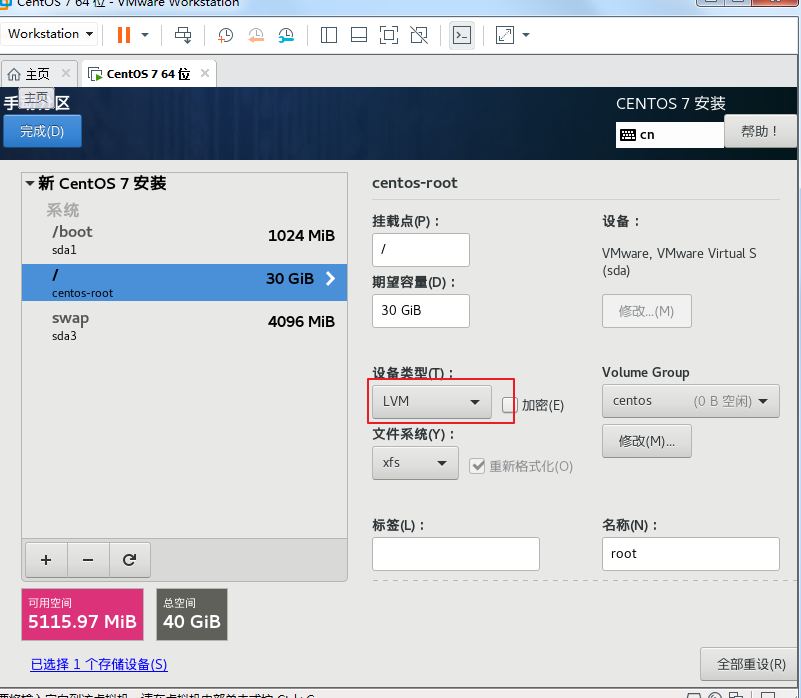
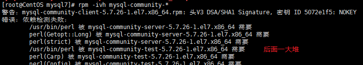
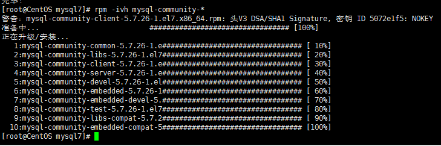
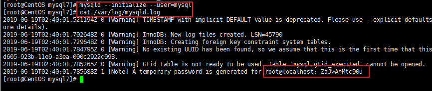
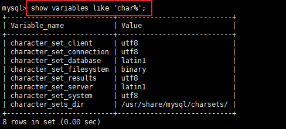
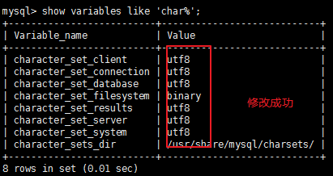

###问题：

​	**命令行用户切换失败**

​	**最小化安装中文乱码： 小方块**

​	**无法切换中文输入**

​	**时间问题**：安装时，时区选择正确，时间也对，但使用时，时间+8

```
可通过date 命令查看时间：
    [root@localhost src]# date
    2019年 03月 30日 星期六 15:57:53 CST
```

​	**yum源：**

```
cannot retrieve mirrorlist http://mirrorlist/centos.org....无法检索镜像源
cannot find a valid baseurl for repo: base/7/x86_64
One of the configured repositories failed (Unknown),  
     and yum doesn't have enough cached data to continue. At this point the only  
     safe thing yum can do is fail. There are a few ways to work "fix" this:
```

<https://blog.csdn.net/weicuidi/article/details/52935100> 

方式1：添加国内的网关

```
1.执行：vi /etc/resolv.conf
2.增加：nameserver 114.114.114.114
3.重启网络服务：service network restart
4.更新yum： yum update 正常的话，会更新软件包
```


**ping www.baidu.com  提示：未知的名称或服务**

```
修改： /etc/sysconfig/network-scripts/ifcfg-ens33  ：
	DNS1="网关ip"
```

**虚拟机能ping通外网和主机，但主机ping不通虚拟机**

```
修改主机中，虚拟机使用的网络连接的 IP，保持在同一个网段,但IP不能完全一样
如：vmnet8:
	 IP：192.168.171.10
	 GATEWAY:192.168.171.2
   虚拟机：
   	 IP：192.168.171.30
   	 GATEWAY:192.168.171.2
```


***

###问题排查：

```
vi前，先cat ，判断文件是否存在

修改文件前：先用cp 命令复制一份，用来备份，再进行修改

```

**2.在图形化界面和命令行界面切换时，系统语言和会变化：**

```
CentOS7 安装的是GUI，选择的是中文。
在图形化界面时，locale 结果是： zh_CN.UTF-8；可以正常显示中文
但切换到命令行界面时，locale 结果变为： en，无法正常显示中文
而且，安装的时候，选择的是最小化安装，不管怎么改语言，中文都会乱码：小方块
```


### 安装：



***

###配置

安全性：<https://blog.csdn.net/qq_2300688967/article/details/81417410> 

#### 用户：

```
root:

	root

wjq:

	Admin.1996

```

 Vmware虚拟机下三种网络模式配置

<https://blog.csdn.net/huapenguag/article/details/78283249> 

####配置静态IP

```
vi   /etc/sysconfig/network-scripts/ifcfg-ens33
```

**根据VMnet 的 网络进行设置：**   **`网段保持一致`**

```
TYPE="Ethernet"   # 网络类型为以太网
BOOTPROTO="static"  # 手动分配ip
NAME="ens33"  # 网卡设备名，设备名一定要跟文件名一致
DEVICE="ens33"  # 网卡设备名，设备名一定要跟文件名一致
ONBOOT="yes"  # 该网卡是否随网络服务启动
IPADDR="192.168.220.101"  # 该网卡ip地址就是你要配置的固定IP
GATEWAY="192.168.220.2"   # 网关
NETMASK="255.255.255.0"   # 子网掩码
#DNS1="8.8.8.8"    # DNS，8.8.8.8为Google提供的免费DNS服务器的IP地址
```

> 如果ping 不通外网，将DNS1，改为网关IP

#### 配置网关：

`vi   /etc/sysconfig/network-scripts/ifcfg-ens33`

编辑DNS即可：

```
DNS1=8.8.8.8 # 谷歌提供的DNS服务器IP地址
DNS2=114.114.114.114 # 国内的DNS服务器IP地址
```

可以在   `/etc/resolv.conf` 文件中查看配置的网关：

```
[root@CentOS mysql]# cat /etc/resolv.conf
# Generated by NetworkManager
search 40G.19.6.6
nameserver 8.8.8.8
nameserver 114.114.114.114
```

`Tips：`

​	DNS是什么？有什么用？

​	域名解析

####重启网络服务

```
service network restart
```

####配置网络工作：

在/etc/sysconfig/network文件里增加如下配置

```
NETWORKING=yes # 网络是否工作，此处一定不能为no
```

####DNS服务[可选]

在/etc/resolv.conf文件里增加如下配置

```
nameserver 8.8.8.8
```

>DNS和DNS1？
>
>DNS作用？
>
>DNS1为什么配成网关后，可以ping通外网
>
>DNS1配置成 8.8.8.8，为什么无法ping 

#### 防火墙设置

查看防火墙：


关闭防火墙：

```
systemctl iptables或者firewalld stop # 临时关闭防火墙
systemctl disable firewalld # 禁止开机启动
```

#### 关闭setLinux

```
查看状态：getenforce:
		结果：enforce	  # setenforce 1 设置SELinux 成为enforcing模式
临时关闭：setenforce 0   #设置SELinux 成为permissive模式
永久关闭：修改/etc/selinux/config 文件（需要重启机器）
		内容：SELINUX=disabled
```

>SELinux 有三种工作模式，分别是：
>
>\1. enforcing：强制模式。违反 SELinux 规则的行为将被阻止并记录到日志中。
>
>\2. permissive：宽容模式。违反 SELinux 规则的行为只会记录到日志中。一般为调试用。
>
>\3. disabled：关闭 SELinux。
>
>enforcing 和 permissive 模式可以通过 setenforce 1|0 命令快速切换。

####重启网络服务

```
service network restart
```

####命令缺失：

##### ifconfig

==最小化安装时，一些命令会cannot find，需要手动安装==

```yum install -y net-tools
yum install -y net-tools
```

==`Tips:`==

​	==常用方式：==

```
查看该命令由谁提供
yum whatprovides ifconfig或yum provides ifconfig
根据提示，下载
yum install net-tools

有时会出问题：cannot find a valid baseurl for repo
```


>第一个地址127.0.0.1是回环地址，网卡名叫lo，Windows操作系统也有该地址，用来自己和自己通信。
>
>第二个地址是192.168.234.131，就是刚刚自动获取的IP地址，其中ens33是网卡的名字

***

修改名称

```
会话生效：hostname DBServer
永久生效：修改/etc/sysconfig/network下的HOSTNAME变量 
```

##### sz/rz

```
要使用sz/rz命令安装lrzsz
	yum -y install lrzsz
----
  sz：将选定的文件发送（send）到本地机器
   rz：运行该命令会弹出一个文件选择窗口，从本地选择文件上传到服务器(receive)
```

##### vim

```
yum list vim查看可以安装的列表，这里选择的是enhanced

yum -y install vim-enhanced
```
####图形化界面

```java
安装：
	yum groupinstall -y "gnome desktop"
切换：
	init 5  # 切换到图形化界面
	init 3  # 切换到命令行界面
```

***

#### 网络类型：

```##
这里是网络类型分配，网络类型分配分为三种，Bridge，NAT和Host-Only，大概区别是

1 BRIDGE:相当于主机和虚拟机连接到同一个交换机（hub）上二者处于同一等级，虚拟机要和主机配置到同一网段上

2 NAT:使用vmnet8，主机开启必要的VMware服务，如vmvare dhcp，虚拟机设置成dhcp方式即可，当然也可以手工设置成vmnet1同一网段，比较麻烦

  在桥接模式下，虚拟机ip地址需要与主机在同一个网段，如果需要联网，则网关与DNS需要与主机网卡一致。


3 HOST-ONLY：使用vmnet1，直接和主机互联，可以使用ifconfig查看配置情况

```

***

##开发环境搭建：

> 参考链接：
>
> https://www.cnblogs.com/guodong-wang/p/7441392.html

### JDK

```
查看是否自动JDK：
	rpm -qa | grep java
有，就删除：
	rpm -e --nodeps 查出的java文件
上传linux 版本的JDK
	rz命令，打开文件系统，选择上传
解压JDK：
	tar -xzvf jdk-8u201-linux-x64.tar.gz
设置jdk环境变量：
	打开/etc/profile配置文件，将下面配置拷贝进去:
	
      #set java environment
      JAVA_HOME=JDK解压后的路径  	 （可进入JDK目录，通过pwd命令查看）
      CLASSPATH=$JAVA_HOME/lib/
      PATH=$PATH:$JAVA_HOME/bin
      export PATH JAVA_HOME CLASSPATH
     
验证结果：
	java -version
```

其他版本环境变量：

```
CLASSPATH=.:$JAVA_HOME/lib.tools.jar

      PATH=JAVA_HOME/bin:PATH

      export JAVA_HOME CLASSPATH PATH

```


***

###mysql

用户：

```
本机：
    root
    admin13579
远程：
    root
    root
```

查看安装地址：

```
where is mysql
[root@localhost etc]# where is mysql
mysql: /usr/bin/mysql /usr/lib64/mysql /usr/share/mysql /usr/share/man/man1/mysql.1.gz
默认安装，一般在/usr/share/或者/usr/local/目录下
```

> 参考链接：
>
> 安装：https://www.cnblogs.com/luohanguo/p/9045391.html 
>
> 配置：https://blog.csdn.net/qq_39740187/article/details/80309676

####yum 安装：

```
下载yum repository
	wget -i -c http://dev.mysql.com/get/mysql57-community-release-el7-10.noarch.rpm
安装yum repository
	yum -y install mysql57-community-release-el7-10.noarch.rpm
检测yum是否按照成功：
	yum repolist enabled | grep "mysql.*-community.*"
安装mysql服务器：
	yum -y install mysql-community-server
```

**成功安装后：**

```
启动mysql服务:
	systemctl start  mysqld.service (.service可以不加)
查看状态：
	systemctl status  mysqld.service
登录：
	mysql -uroot -p密码
修改初始密码：
	ALTER USER 'root'@'localhost' IDENTIFIED BY '新密码';
开启远程登录...

关闭mysql服务:
	systemctl stop mysqld
修改后，即可正常操作

因为安装了yum repository,以后每次操作，都会自动更新，需要卸载之前下载的：mysql yum
	yum -y remove mysql57-community-release-el7-10.noarch
```

>mysql第一次安装时，会自动创建一个root用户，自动生成初始密码
>
>**查看初始密码：**`grep "password" /var/log/mysqld.log`
>
>初次登录后，必须修改初始密码，而mysql密码设置有严格的规范,需要修改规范，才能成功设置密码
>
>**查看密码设置规范**：`SHOW VARIABLES LIKE 'validate_password%';`
>
>```
>validate_password_policy：密码策略，默认为MEDIUM策略 
>validate_password_dictionary_file：密码策略文件，策略为STRONG才需要 
>validate_password_length：密码最少长度 
>validate_password_mixed_case_count：大小写字符长度，至少1个 
>validate_password_number_count ：数字至少1个 
>validate_password_special_char_count：特殊字符至少1个 
>上述参数是默认策略MEDIUM的密码检查规则。
>选择0（LOW），1（MEDIUM），2（STRONG）
>```
>
>**修改密码规范**：
>
>```
>mysql> set global validate_password_policy=0;
>mysql> set global validate_password_length=1;
>```

> **也可以直接禁用密码策略：**
>
> 修改my.cnf文件，增加：
>
> ```
> validate_password = off
> ```
>
> **修改初始密码:**
>
> ```ALTER USER 'root'@'localhost' IDENTIFIED BY 'new password';	
> ALTER USER 'root'@'localhost' IDENTIFIED BY '新密码';
> ```

***

####配置文件位置：

```

配置文件：默认配置文件路径： 
配置文件：/etc/my.cnf 
日志文件：/var/log/mysqld.log 
服务启动脚本：/usr/lib/systemd/system/mysqld.service 
```

#### 设置字符集：

`vi /etc/my.cnf `

```
[mysqld]
character_set_server=utf8
init_connect='SET NAMES utf8'
```

####设置开启启动【可选】：

```
systemctl enable mysqld
systemctl daemon-reload
```

####设置path环境变量:

​	如果采用yum  安装，不需要配置

​	自己解压安装的，需要配置

`vi /etc/profile`

```
MYSQL_HOME=安装路径

PATH=$PATH:$MYSQL_HOME/bin  （：分割，还会有其他软件的，如JDK）

export PATH MYSQL_HOME  (可加在其他export 后)
```


#### 开放端口：

​	**增加mysql连接端口[可选]**

```
查看端口（需登录MySQL）：
	show global variables like 'port'
	默认只有一个端口：3306
修改端口：
	编辑/etc/my.cnf文件  [root@localhost ~]# vi /etc/my.cnf
	添加port=2032;
重启MySQL服务
```

​	**开放linux端口【必选】**

```
firewall-cmd --zone=public --add-port=3306/tcp --permanent  #在public中永久开放3306端口
firewall-cmd --reload # 重新加载
```


`Tips:`

`firewall`相关操作：

>```
># firewall-cmd --list-all-zones    #查看所有的zone信息
>
># firewall-cmd --get-default-zone     #查看默认zone是哪一个
>
># firewall-cmd --zone=internal --change-zone=p3p1  #临时修改接口p3p1所属的zone为internal
>
># firewall-cmd --add-service=http    #暂时开放http
>
># firewall-cmd --permanent --add-service=http  #永久开放http
>
># firewall-cmd --zone=public --add-port=80/tcp --permanent  #在public中永久开放80端口
>
># firewall-cmd --permanent --zone=public --remove-service=ssh   #从public zone中移除服务
>
># firewall-cmd --reload   #重新加载配置
>```
>
>

####关闭防火墙：

>关闭防火墙，windows才能远程访问
>
>```
>systemctl stop firewalld.service
>systemctl disable firewalld.service
>```

####远程登录：

​	因为mysql远程登录默认关闭，所有需要Windows操作linux中的mysql时，需要开启远程登录：

参考链接：https://www.cnblogs.com/lxwphp/p/8941723.html

**改表法：**

```
允许任意IP访问使用root用户访问（可指定IP）：
	update user set host = '%' where user = 'root';
刷新权限：
	flush privileges;
```

**授权法：**

```
任意IP：
	grant all privileges on *.* to root@'%' identified by '密码';
指定IP：
	GRANT ALL PRIVILEGES ON *.* to '指定用户'@'IP地址' IDENTIFIED BY '密码' WITH GRANT OPTION;
刷新权限：
	 flush privileges 
	 
配置完后,windows，可通过以下命令远程访问
	mysql -hIP地址 -u用户名 -p密码 
	

```

### 无网络安装：

​	<https://blog.csdn.net/u012248802/article/details/80576869> 

#### 下载并上传mysql:

​	以mysql-5.7.26-1.el7.x86_64.rpm-bundle.tar版本为例

```
1.官网下载
2.上传到linux系统
```

#### 解压安装：

```
tar -xvf mysql-5.7.26-1.el7.x86_64.rpm-bundle.tar
rpm -ivh mysql-community-*
```

安装时可能会出现缺少依赖问题



提示缺少perl相关依赖：

```properties
rpm -ivh perl-Data-Dumper-2.145-3.el7.x86_64.rpm
yum -y install perl-JSON.noarch
```

`tips:`

本地有依赖的安装包,上传后执行：

```
rpm -ivh perl-Data-Dumper-2.145-3.el7.x86_64.rpm
```

本地没有，通过下述命令安装：

```
yum -y install 要安装的依赖包名
```

依赖解决后,开始安装mysql：

```
rpm -ivh mysql-community-*

```



#### 初始化

​	初始化，会生成一个初始密码，并存于    `/var/log/mysqld.log`文件中

```
初始化：mysqld --initialize --user=mysql
查看初始密码：cat /var/log/mysqld.log
```



#### 启动服务：

```
systemctl start mysqld
```

#### 登录：

```
mysql -uroot -p密码admin*13579*
```

#### 修改root密码：

​	使用初始密码登录后，需要先修改密码，才能完成其他操作

```
ALTER user 'root'@'localhost' IDENTIFIED BY '新密码'
```

`Tips:`

​	密码的设置有一定规则，见    `yum安装部分`

#### 设置字符集：

主要是将 `latin1` 设置为  `utf-8`

```
登录mysql后,查看字符集：
show variables like 'char%';
```



```properties
vi /etc/my.cnf
编辑：
    [client]
    default-character-set=utf8
    [mysqld]
    character-set-server=utf8
    collation-server=utf8_general_ci
```

修改后，重启mysql服务，可再次查看字符集：

```
service mysqld restart
```



#### 开启远程访问：

1.设置权限

```
1.设置权限
grant all privileges on *.* to 'root'@'%' identified by 'admin13579' with grant option;
2.刷新：
flush privileges;
```

2.开放3306端口：

```properties
firewall-cmd --zone=public --add-port=3306/tcp --permanent
firewall-cmd --reload
```

`tips:`

​	`firewall-cmd` 中的  `-` 紧跟 ` firewall`,

#### 将mysql设置开启启动：

```
systemctl enable mysqld
systemctl daemon-reload
```

***

### tomcat:

***

### redis：

***

### activeMQ:

***

### rabbitMQ

***

### fastDfs:


